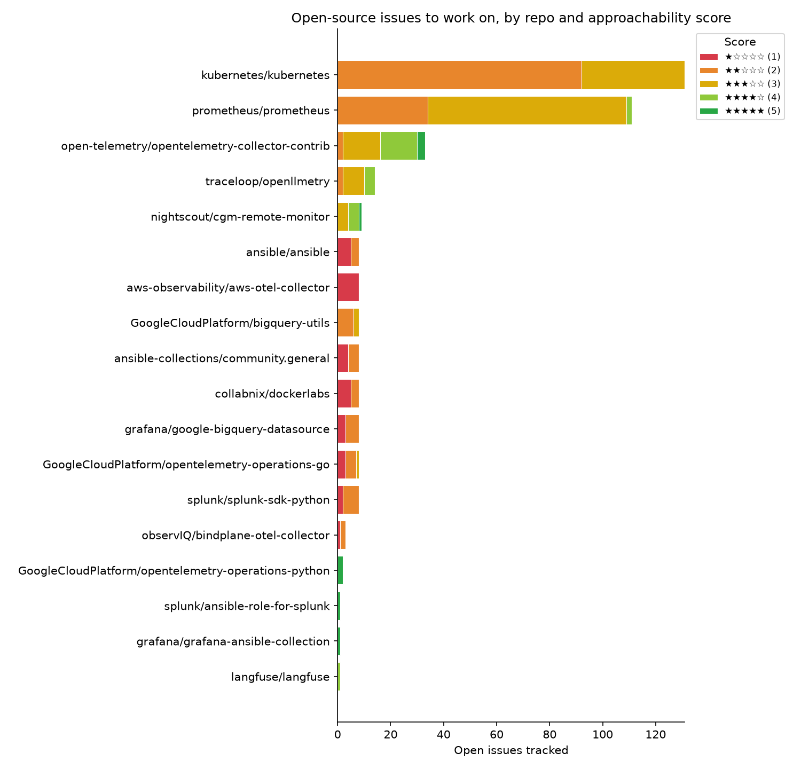
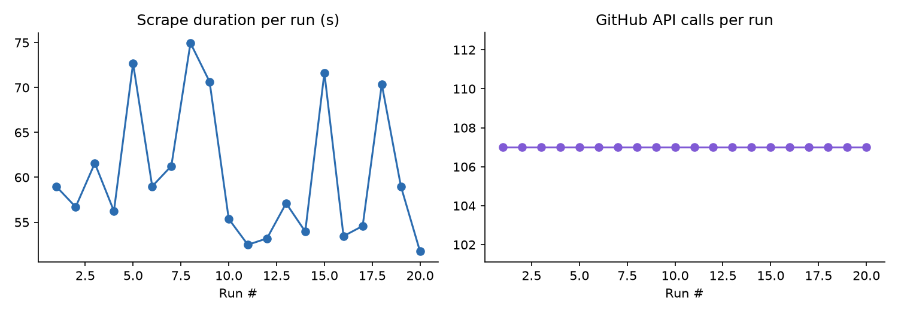

# oss-issue-tracker

[](https://github.com/marly10/oss-issue-tracker/actions/workflows/ci.yml)
[](https://github.com/marly10/oss-issue-tracker/actions/workflows/weekly-scrape.yml)
[](LICENSE)
[](pyproject.toml)

Dynamic contribution radar: scans every repo I've forked, resolves each one's real upstream, pulls its open issues, and scores them by how approachable they are — so I can decide what to work on next without manually digging through issue trackers. Refreshed every Monday by GitHub Actions, with a Slack summary and a chart, not just a wall of markdown.

## Why I built this

I wanted to start contributing to open source in the projects I actually use at work (OpenTelemetry/Bindplane, Grafana's BigQuery datasource, the GCP Terraform provider), but the actual bottleneck wasn't motivation — it was that "go look for a good issue" is a task I'd always defer indefinitely because it required opening ten tabs and skimming label lists. This tool turns that into a five-minute Monday-morning read: one Slack message, one chart, done.

It's also, deliberately, not just a personal script. Anyone can fork this repo, change one line in `config.toml`, and get the same weekly radar pointed at their own GitHub account.

## How it works

```
your forks (GitHub API)
      │
      ▼
resolve each fork's real upstream repo
      │
      ▼
pull open issues from the upstream (retries + rate-limit tracking)
      │
      ▼
score each issue 1-5★ (scoring.py — pure function, unit tested)
      │
      ├──► chart.py    → assets/issues_by_repo.png (stacked bar, by score)
      ├──► metrics.py  → metrics/history.jsonl (structured run telemetry)
      ├──► readme.py   → README.md (atomic write — never a half-written file)
      └──► slack.py    → weekly summary + top picks
```

Every box above is a separate, independently tested module under `src/oss_issue_tracker/` — see [`cli.py`](src/oss_issue_tracker/cli.py) for the orchestration.

## Using this for your own account

1. Fork this repo.
2. Edit `config.toml` — change `username` under `[github]` to yours.
3. Edit `excluded_repos.txt` to skip any forks that aren't real contribution targets (course projects, toy repos, etc).
4. Add a `SLACK_WEBHOOK_URL` repo secret if you want Slack notifications (Settings → Secrets and variables → Actions). Skip this and it just won't notify — everything else still works.
5. The weekly workflow runs automatically. Trigger it manually anytime from the Actions tab if you don't want to wait for Monday.

No code changes needed for a basic fork — that's the point.

## How scoring works

Each issue gets a 1-5★ approachability score, computed in [`scoring.py`](src/oss_issue_tracker/scoring.py) (formula is documented in the function's own docstring, and every branch of it is covered by [`tests/test_scoring.py`](tests/test_scoring.py)):

- `good first issue` / `beginner-friendly` label → +3
- `help wanted` / `up-for-grabs` label → +2
- `bug` or `enhancement` label → +1
- Zero comments (nobody's claimed or debated it) → +1
- More than 10 comments (likely contested or stale) → -1

Repos with no labeled beginner-friendly issues fall back to showing their most recently updated open issues, so quiet repos don't just disappear from the table. Label sets are configurable per-fork in `config.toml`, not hardcoded.

## Engineering notes

A few decisions worth explaining rather than leaving implicit:

- **`tomllib` over a YAML/config dependency.** Config parsing needed exactly one feature (typed key-value config), and Python 3.11+ ships that in the standard library. Pulling in PyYAML for this would be a dependency for a problem already solved.
- **Atomic README writes.** `readme.py` writes to a temp file and `os.replace()`s it into place. If the process dies mid-write (OOM-killed runner, network blip during a later step), the committed README is never left truncated — worst case, the update simply didn't happen this week.
- **Retries live in the HTTP adapter, not sprinkled through business logic.** `github_client.py` configures `urllib3`'s `Retry` once, at the session level, so `chart.py`/`readme.py`/`scoring.py` never need to know the network is unreliable. GitHub's primary rate limit (a 403 with `X-RateLimit-Remaining: 0`) is handled as a distinct case from generic 5xx/429s, since it needs a different response than "retry with backoff" — the run should stop and report it, not hammer an exhausted quota.
- **Structured metrics, human-readable logs — deliberately not the same thing.** Console output during a run is plain text, because its only consumer is a person reading the Actions log. `metrics/history.jsonl` is one structured JSON object per run instead, specifically so it could be ingested by a real metrics pipeline later without a format change. Conflating "what a human wants to read right now" with "what a machine should be able to query later" is a common source of bad logging; this repo keeps them separate on purpose.
- **`excluded_repos.txt` instead of auto-filtering "real" OSS repos.** I could try to heuristically guess which forks are course assignments vs. real contribution targets, but that's a judgment call that belongs to whoever's running the tool, not a heuristic. A plain-text opt-out file keeps that decision explicit and easy to audit.

## Development

```bash
pip install -e ".[dev]"
ruff check .
pytest -v
```

See [CONTRIBUTING.md](CONTRIBUTING.md) for the full contributor workflow — including, fittingly, guidance on what makes a good PR to a tool about making good PRs.

## Tracked issues

<!-- TRACKER:START -->

_Last updated: 2026-07-23 04:49 UTC_

_Tracking **18** upstream repos, **382** relevant open issues._



### [GoogleCloudPlatform/bigquery-utils](https://github.com/GoogleCloudPlatform/bigquery-utils)

| Score | Issue | Labels | Comments | Updated |
|---|---|---|---|---|
| ★★★☆☆ | [#459](https://github.com/GoogleCloudPlatform/bigquery-utils/issues/459) Add Script for On Demand vs. Reservation Analysis | enhancement | 0 | 2024-10-01 |
| ★★☆☆☆ | [#518](https://github.com/GoogleCloudPlatform/bigquery-utils/issues/518) bqutil resources are inaccessible via Workload Identity Federation | — | 0 | 2025-12-23 |
| ★★☆☆☆ | [#484](https://github.com/GoogleCloudPlatform/bigquery-utils/issues/484) Add unit testing for colab notebooks | — | 0 | 2025-03-19 |
| ★★☆☆☆ | [#465](https://github.com/GoogleCloudPlatform/bigquery-utils/issues/465) Fix CI/CD pipeline to prevent multiple builds from clobbering cloud storage folders | enhancement | 1 | 2025-01-06 |
| ★★☆☆☆ | [#453](https://github.com/GoogleCloudPlatform/bigquery-utils/issues/453) Unable to find module in theta_sketch.mjs for theta_sketch_int64 | bug | 2 | 2024-12-16 |
| ★★☆☆☆ | [#379](https://github.com/GoogleCloudPlatform/bigquery-utils/issues/379) Missing Datasource for Hourly Utilization Heatmap section | bug | 1 | 2024-10-03 |
| ★★☆☆☆ | [#422](https://github.com/GoogleCloudPlatform/bigquery-utils/issues/422) Add a queries_grouped_by_session.sql script to the optimization/ scripts | enhancement | 1 | 2024-09-18 |
| ★☆☆☆☆ | [#544](https://github.com/GoogleCloudPlatform/bigquery-utils/issues/544) theta_sketch_* UDFs hang until query timeout on estimation-mode sketches (started ~mid-June 2026, europe-west1) | — | 2 | 2026-06-25 |

### [GoogleCloudPlatform/opentelemetry-operations-go](https://github.com/GoogleCloudPlatform/opentelemetry-operations-go)

| Score | Issue | Labels | Comments | Updated |
|---|---|---|---|---|
| ★★★☆☆ | [#1038](https://github.com/GoogleCloudPlatform/opentelemetry-operations-go/issues/1038) Disabling the normalizer breaks unknown metrics | bug, priority: p2 | 0 | 2025-05-20 |
| ★★☆☆☆ | [#912](https://github.com/GoogleCloudPlatform/opentelemetry-operations-go/issues/912) Dependency Dashboard | priority: p3, dependencies | 0 | 2026-07-23 |
| ★★☆☆☆ | [#946](https://github.com/GoogleCloudPlatform/opentelemetry-operations-go/issues/946) Add support for tracking metrics with `Cloud Run` resource type | enhancement | 6 | 2026-03-18 |
| ★★☆☆☆ | [#1039](https://github.com/GoogleCloudPlatform/opentelemetry-operations-go/issues/1039) Cloud Trace does not display error span status description | bug, priority: p3, Blocked | 4 | 2025-06-02 |
| ★★☆☆☆ | [#1026](https://github.com/GoogleCloudPlatform/opentelemetry-operations-go/issues/1026) GCP detector ignores context | bug, priority: p1 | 2 | 2025-05-28 |
| ★☆☆☆☆ | [#1176](https://github.com/GoogleCloudPlatform/opentelemetry-operations-go/issues/1176) Add GKE host type detection to the GCP detector | — | 4 | 2026-07-07 |
| ★☆☆☆☆ | [#1099](https://github.com/GoogleCloudPlatform/opentelemetry-operations-go/issues/1099) Migrate googleclientauth extension to use credentials.DetectDefault | — | 1 | 2026-01-26 |
| ★☆☆☆☆ | [#1068](https://github.com/GoogleCloudPlatform/opentelemetry-operations-go/issues/1068) Duplicate label key encountered service_name on trace metrics | — | 22 | 2025-09-29 |

### [GoogleCloudPlatform/opentelemetry-operations-python](https://github.com/GoogleCloudPlatform/opentelemetry-operations-python)

| Score | Issue | Labels | Comments | Updated |
|---|---|---|---|---|
| ★★★★★ | [#357](https://github.com/GoogleCloudPlatform/opentelemetry-operations-python/issues/357) Unsupported metric data type ExponentialHistogram in opentelemetry-exporter-gcp-monitoring | enhancement, good first issue, priority: p2, enhancement accepted | 2 | 2025-06-23 |
| ★★★★★ | [#265](https://github.com/GoogleCloudPlatform/opentelemetry-operations-python/issues/265) Verify non-GKE resources map to `k8s_*` monitored resources | enhancement, good first issue, priority: p2, enhancement accepted | 1 | 2024-08-28 |

### [ansible-collections/community.general](https://github.com/ansible-collections/community.general)

| Score | Issue | Labels | Comments | Updated |
|---|---|---|---|---|
| ★★☆☆☆ | [#11365](https://github.com/ansible-collections/community.general/issues/11365) Pickle inventory cache always result in cache misses | bug, has_pr, cache, plugins | 5 | 2026-07-22 |
| ★★☆☆☆ | [#12422](https://github.com/ansible-collections/community.general/issues/12422) lxc_container doesn't wait for returned IP | bug, module, plugins | 2 | 2026-07-20 |
| ★★☆☆☆ | [#11331](https://github.com/ansible-collections/community.general/issues/11331) btrfs mountpoint scan does not account for symlinks | bug, module, has_pr, plugins | 6 | 2026-07-12 |
| ★★☆☆☆ | [#12388](https://github.com/ansible-collections/community.general/issues/12388) consul_kv: deprecate and remove get_value | bug, module, plugins | 2 | 2026-07-12 |
| ★★☆☆☆ | [#8980](https://github.com/ansible-collections/community.general/issues/8980) incus conn plugin: Intermittent Issues with Temporary Directory Creation and Connection Drops | bug | 8 | 2026-07-11 |
| ★☆☆☆☆ | [#12454](https://github.com/ansible-collections/community.general/issues/12454) nmcli: Option to set ipv4.route-table, ipv6.route-table | feature, module, plugins | 2 | 2026-07-22 |
| ★☆☆☆☆ | [#11482](https://github.com/ansible-collections/community.general/issues/11482) Releasing, Versioning and Deprecation (2/N) | admin | 12 | 2026-07-13 |
| ★☆☆☆☆ | [#12029](https://github.com/ansible-collections/community.general/issues/12029) Deprecate xml module's `print_match`, `count`, and `content` options | feature, module, has_pr, plugins | 3 | 2026-07-13 |

### [ansible/ansible](https://github.com/ansible/ansible)

| Score | Issue | Labels | Comments | Updated |
|---|---|---|---|---|
| ★★☆☆☆ | [#87272](https://github.com/ansible/ansible/issues/87272) connection/ssh.py: fragile test in _bare_run() breaks sftp/scp | bug, has_pr, affects_2.21 | 3 | 2026-07-21 |
| ★★☆☆☆ | [#87271](https://github.com/ansible/ansible/issues/87271) ansible-galaxy gives misleading error message when collection does not exist | bug, has_pr, affects_2.21 | 2 | 2026-07-21 |
| ★★☆☆☆ | [#87100](https://github.com/ansible/ansible/issues/87100) Role search path implicitly includes working directory of ansible-playbook command | bug, has_pr, needs_verified, affects_2.20 | 4 | 2026-07-20 |
| ★★☆☆☆ | [#44869](https://github.com/ansible/ansible/issues/44869) setup module: gathering facts fails on FreeBSD if tunnel is present | easyfix, module, bug, has_pr, affects_2.6, P3 | 7 | 2026-07-19 |
| ★★☆☆☆ | [#87228](https://github.com/ansible/ansible/issues/87228) powershell exec_wrapper fails when multiple powershell.exe entries are found in PATH | bug, has_pr, affects_2.21 | 1 | 2026-07-18 |
| ★☆☆☆☆ | [#71209](https://github.com/ansible/ansible/issues/71209) Using passwd command to change a user password instead of usermod | module, feature, P3, affects_2.11, security | 7 | 2026-07-22 |
| ★☆☆☆☆ | [#84451](https://github.com/ansible/ansible/issues/84451) Register `faulthandler` for all python processes | feature | 3 | 2026-07-21 |
| ★☆☆☆☆ | [#84332](https://github.com/ansible/ansible/issues/84332) inconsistent behavior between delegate_to: "" and delegate_to: "{{ undef() \| default('') }}" | bug, has_pr, P3, verified, affects_2.18 | 22 | 2026-07-19 |

### [aws-observability/aws-otel-collector](https://github.com/aws-observability/aws-otel-collector)

| Score | Issue | Labels | Comments | Updated |
|---|---|---|---|---|
| ★☆☆☆☆ | [#2462](https://github.com/aws-observability/aws-otel-collector/issues/2462) ECS FireLens compatibiltiy: Make it a drop in replacement for aws for fluent bit | logs, stale | 38 | 2026-07-20 |
| ★☆☆☆☆ | [#3084](https://github.com/aws-observability/aws-otel-collector/issues/3084) Clarification on maintenance status of awscloudwatchlogsexporter in ADOT Collector | stale | 9 | 2026-07-19 |
| ★☆☆☆☆ | [#3194](https://github.com/aws-observability/aws-otel-collector/issues/3194) aws-otel-collector-ctl fails with "unknown init system" on systemd hosts with multiple -.mount units | stale | 1 | 2026-07-19 |
| ★☆☆☆☆ | [#3199](https://github.com/aws-observability/aws-otel-collector/issues/3199) awsxray exporter logs Go pointer addresses instead of UnprocessedTraceSegments error messages | stale | 1 | 2026-07-19 |
| ★☆☆☆☆ | [#3225](https://github.com/aws-observability/aws-otel-collector/issues/3225) awsemf exporter repeatedly fails with PutLogEvents "context deadline exceeded" during startup since ADOT 0.44.0 (works in 0.43.3) | — | 4 | 2026-07-14 |
| ★☆☆☆☆ | [#3162](https://github.com/aws-observability/aws-otel-collector/issues/3162) AWS exporters fail to refresh externally-rotated credentials (e.g., SSM hybrid-activated on-prem instances) | — | 4 | 2026-07-12 |
| ★☆☆☆☆ | [#3177](https://github.com/aws-observability/aws-otel-collector/issues/3177) Request to release OTEL latest version v.0.48.0 on AWS ECR | stale | 1 | 2026-07-12 |
| ★☆☆☆☆ | [#3213](https://github.com/aws-observability/aws-otel-collector/issues/3213) Need to Upgrade golang.org/x/net & golang.org/x/crypto version | — | 2 | 2026-07-09 |

### [collabnix/dockerlabs](https://github.com/collabnix/dockerlabs)

| Score | Issue | Labels | Comments | Updated |
|---|---|---|---|---|
| ★★☆☆☆ | [#544](https://github.com/collabnix/dockerlabs/issues/544) A New Modern Look for Docker Labs | — | 0 | 2026-03-25 |
| ★★☆☆☆ | [#452](https://github.com/collabnix/dockerlabs/issues/452) Define journey for Azure, AWS and Google Cloud Engineers | — | 0 | 2022-08-02 |
| ★★☆☆☆ | [#413](https://github.com/collabnix/dockerlabs/issues/413) A weird IP in this HA K8S deployment doc   10.10.40.10   ? | — | 0 | 2022-01-23 |
| ★☆☆☆☆ | [#549](https://github.com/collabnix/dockerlabs/issues/549) PWD lab plaform deprecated | — | 2 | 2026-03-25 |
| ★☆☆☆☆ | [#536](https://github.com/collabnix/dockerlabs/issues/536) docs: Capabilities page - Images can store file-based capabilities | — | 2 | 2024-01-09 |
| ★☆☆☆☆ | [#508](https://github.com/collabnix/dockerlabs/issues/508) [docker] Upgrade labs for cross-platform compatibility | — | 3 | 2023-09-30 |
| ★☆☆☆☆ | [#456](https://github.com/collabnix/dockerlabs/issues/456) Improve Sample Apps section - Add a showcase page | — | 2 | 2023-08-24 |
| ★☆☆☆☆ | [#293](https://github.com/collabnix/dockerlabs/issues/293) Etcd config mistake | — | 2 | 2022-12-02 |

### [grafana/google-bigquery-datasource](https://github.com/grafana/google-bigquery-datasource)

| Score | Issue | Labels | Comments | Updated |
|---|---|---|---|---|
| ★★★☆☆ | [#110](https://github.com/grafana/google-bigquery-datasource/issues/110) Documentation: Add more verbose documentation for macros support | documentation, type/feature-request, help wanted, stale | 1 | 2026-07-16 |

### [grafana/grafana-ansible-collection](https://github.com/grafana/grafana-ansible-collection)

| Score | Issue | Labels | Comments | Updated |
|---|---|---|---|---|
| ★★★★★ | [#268](https://github.com/grafana/grafana-ansible-collection/issues/268) Add Workflow to Upload collection verion to Ansible Galaxy | good first issue, help wanted | 0 | 2024-09-13 |

### [kubernetes/kubernetes](https://github.com/kubernetes/kubernetes)

| Score | Issue | Labels | Comments | Updated |
|---|---|---|---|---|
| ★★★☆☆ | [#140489](https://github.com/kubernetes/kubernetes/issues/140489) Add `[Feature:Networking-IPv6]` and `[Feature:SCTPConnectivity]` CI | sig/network, help wanted, sig/testing, area/ipv6, triage/accepted, area/network-policy | 9 | 2026-07-22 |
| ★★★☆☆ | [#115939](https://github.com/kubernetes/kubernetes/issues/115939) Reuse the http request object for http probes | area/kubelet, sig/node, help wanted, good first issue, needs-triage | 46 | 2026-07-22 |
| ★★★☆☆ | [#126379](https://github.com/kubernetes/kubernetes/issues/126379) add and use alternative APIs which support contextual logging | area/logging, kind/feature, help wanted, sig/instrumentation, good first issue, triage/accepted, wg/structured-logging | 40 | 2026-07-17 |
| ★★★☆☆ | [#124435](https://github.com/kubernetes/kubernetes/issues/124435) Provide Zip archive for downloads of Windows binaries | kind/feature, area/release-eng, help wanted, sig/release, triage/accepted | 10 | 2026-07-16 |
| ★★★☆☆ | [#114369](https://github.com/kubernetes/kubernetes/issues/114369) NetworkPolicy tests for blocking north/south traffic | priority/backlog, sig/network, help wanted, good first issue, triage/accepted, area/network-policy | 38 | 2026-07-15 |
| ★★★☆☆ | [#138149](https://github.com/kubernetes/kubernetes/issues/138149) Migrate DRA components to support granular authorization on status updates | sig/network, sig/node, sig/auth, help wanted, good first issue, triage/accepted, wg/device-management | 71 | 2026-07-14 |
| ★★★☆☆ | [#135058](https://github.com/kubernetes/kubernetes/issues/135058) DRA: measure and track performance of "experimental" allocator | kind/feature, help wanted, good first issue, needs-triage, wg/device-management | 20 | 2026-06-17 |
| ★★★☆☆ | [#115782](https://github.com/kubernetes/kubernetes/issues/115782) Write the stress test for gRPC, http, and tcp probes | priority/backlog, kind/cleanup, sig/node, help wanted, good first issue, needs-triage | 39 | 2026-06-16 |

### [langfuse/langfuse](https://github.com/langfuse/langfuse)

| Score | Issue | Labels | Comments | Updated |
|---|---|---|---|---|
| ★★★★☆ | [#12786](https://github.com/langfuse/langfuse/issues/12786) bug: PostHog integration export overwhelms target instance with unbounded burst (18k events/sec observed) | good first issue, performance, improvement, feat-exports, integration-posthog | 5 | 2026-07-19 |

### [nightscout/cgm-remote-monitor](https://github.com/nightscout/cgm-remote-monitor)

| Score | Issue | Labels | Comments | Updated |
|---|---|---|---|---|
| ★★★★★ | [#7766](https://github.com/nightscout/cgm-remote-monitor/issues/7766) Add base_uri variable (for proxy) | enhancement, help wanted, feature/deployment-setup, feature request | 0 | 2025-05-22 |
| ★★★★★ | [#6676](https://github.com/nightscout/cgm-remote-monitor/issues/6676) Horizontal Scrolling with mouse wheel (holding Shift key) | good-first-issue | 0 | 2025-05-16 |
| ★★★★☆ | [#8048](https://github.com/nightscout/cgm-remote-monitor/issues/8048) Clock whit seconds | feature request, good-first-issue | 1 | 2026-06-30 |
| ★★★★☆ | [#8192](https://github.com/nightscout/cgm-remote-monitor/issues/8192) List items are not scrollable when viewing Food Editor on mobile. | good-first-issue | 1 | 2026-06-17 |
| ★★★★☆ | [#7441](https://github.com/nightscout/cgm-remote-monitor/issues/7441) Link to step-by-step guide for updating does not work anymore | docs, good-first-issue | 2 | 2026-05-21 |
| ★★★★☆ | [#7540](https://github.com/nightscout/cgm-remote-monitor/issues/7540) BASE_URL and sub-directories. | good-first-issue | 6 | 2025-07-22 |
| ★★★★☆ | [#7377](https://github.com/nightscout/cgm-remote-monitor/issues/7377) Clock views don't show when token auth is used | clock, good-first-issue | 1 | 2025-05-22 |
| ★★★☆☆ | [#5742](https://github.com/nightscout/cgm-remote-monitor/issues/5742) Custom WebHook Support | help wanted, feature request | 2 | 2026-06-15 |

### [observIQ/bindplane-otel-collector](https://github.com/observIQ/bindplane-otel-collector)

| Score | Issue | Labels | Comments | Updated |
|---|---|---|---|---|
| ★★☆☆☆ | [#2542](https://github.com/observIQ/bindplane-otel-collector/issues/2542) Add TCP Check receiver | — | 0 | 2025-08-23 |
| ★☆☆☆☆ | [#2296](https://github.com/observIQ/bindplane-otel-collector/issues/2296) install_unix.sh breaks with status code 2 in non-interactive environments | — | 4 | 2026-03-04 |

### [open-telemetry/opentelemetry-collector-contrib](https://github.com/open-telemetry/opentelemetry-collector-contrib)

| Score | Issue | Labels | Comments | Updated |
|---|---|---|---|---|
| ★★★★★ | [#48420](https://github.com/open-telemetry/opentelemetry-collector-contrib/issues/48420) [processor/tailsampling] Change default `error_mode` to `ignore` | enhancement, help wanted, good first issue, Stale, processor/tailsampling | 4 | 2026-07-20 |
| ★★★★★ | [#48419](https://github.com/open-telemetry/opentelemetry-collector-contrib/issues/48419) [connector/signaltometrics] Change default `error_mode` to `ignore` | enhancement, help wanted, good first issue, connector/signaltometrics | 5 | 2026-05-30 |
| ★★★★★ | [#38092](https://github.com/open-telemetry/opentelemetry-collector-contrib/issues/38092) [CI/CD\| run no race tests in CIs too | enhancement, good first issue, ci-cd, never stale | 9 | 2026-05-21 |
| ★★★★★ | [#39333](https://github.com/open-telemetry/opentelemetry-collector-contrib/issues/39333) Add system.cpu.socket.id and system.cpu.core.id attributes | enhancement, good first issue, Stale, processor/resourcedetection, never stale | 9 | 2026-01-20 |
| ★★★★☆ | [#31387](https://github.com/open-telemetry/opentelemetry-collector-contrib/issues/31387) [pkg/ottl] Improve OTTL Docs | enhancement, help wanted, good first issue, priority:p2, processor/filter, processor/transform, pkg/ottl, never stale | 13 | 2026-07-21 |
| ★★★★☆ | [#39053](https://github.com/open-telemetry/opentelemetry-collector-contrib/issues/39053) [receiver_creator] Started components not reporting status | enhancement, help wanted, never stale, receiver/receivercreator | 4 | 2026-07-21 |
| ★★★★☆ | [#43918](https://github.com/open-telemetry/opentelemetry-collector-contrib/issues/43918) [aws/k8s] TestGetShutdown is failing on Windows after upgrading k8s library to 1.34 | bug, help wanted, good first issue, internal/aws | 12 | 2026-07-15 |
| ★★★★☆ | [#48186](https://github.com/open-telemetry/opentelemetry-collector-contrib/issues/48186) Deprecate and remove kafkatopicsobserver | good first issue, extension/observer/kafkatopicsobserver | 10 | 2026-07-09 |

### [prometheus/prometheus](https://github.com/prometheus/prometheus)

| Score | Issue | Labels | Comments | Updated |
|---|---|---|---|---|
| ★★★★☆ | [#14342](https://github.com/prometheus/prometheus/issues/14342) [Remote Write 2.x] Arrow Proto Message Experiment & Benchmark | help wanted, priority/Pmaybe, component/remote storage, not-as-easy-as-it-looks, kind/optimization | 0 | 2024-06-25 |
| ★★★★☆ | [#1220](https://github.com/prometheus/prometheus/issues/1220) Preview alerts in expression browser | help wanted, kind/enhancement, component/ui, priority/P3 | 0 | 2024-02-13 |
| ★★★☆☆ | [#15863](https://github.com/prometheus/prometheus/issues/15863) Enhancements to kubernetes_sd_config to support Gateway API resources | help wanted, component/service discovery, kind/feature, component/service discovery/kubernetes | 7 | 2026-07-22 |
| ★★★☆☆ | [#14763](https://github.com/prometheus/prometheus/issues/14763) Start Timestamp: Opt-in ST auto-generation globally/per scrape job. | help wanted, kind/feature | 3 | 2026-07-14 |
| ★★★☆☆ | [#14057](https://github.com/prometheus/prometheus/issues/14057) Add relabeling action that drops sample if any label matches pattern | help wanted, component/config, priority/P3, kind/feature | 4 | 2026-07-08 |
| ★★★☆☆ | [#16176](https://github.com/prometheus/prometheus/issues/16176) TestDBReadOnly_Querier_NoAlteration is flaky on Windows | help wanted, component/tests | 5 | 2026-07-08 |
| ★★★☆☆ | [#16513](https://github.com/prometheus/prometheus/issues/16513) Idea: store scrape cache as a trie instead of a map. | help wanted, kind/enhancement, component/scraping | 10 | 2026-07-08 |
| ★★★☆☆ | [#10953](https://github.com/prometheus/prometheus/issues/10953) Configuring PromQL query statistics | help wanted, kind/enhancement, priority/P3, component/api | 8 | 2026-07-07 |

### [splunk/ansible-role-for-splunk](https://github.com/splunk/ansible-role-for-splunk)

| Score | Issue | Labels | Comments | Updated |
|---|---|---|---|---|
| ★★★★★ | [#102](https://github.com/splunk/ansible-role-for-splunk/issues/102) Enhancement: Add support to perform rolling upgrades for shc and idx | enhancement, help wanted | 0 | 2021-09-15 |

### [splunk/splunk-sdk-python](https://github.com/splunk/splunk-sdk-python)

| Score | Issue | Labels | Comments | Updated |
|---|---|---|---|---|
| ★★★☆☆ | [#677](https://github.com/splunk/splunk-sdk-python/issues/677) Empty accelerated fields leads to TypeError | bug, KV Store | 0 | 2025-11-13 |
| ★★☆☆☆ | [#785](https://github.com/splunk/splunk-sdk-python/issues/785) Splunk core -> python3.13 | — | 0 | 2026-05-13 |
| ★★☆☆☆ | [#704](https://github.com/splunk/splunk-sdk-python/issues/704) Unverified SSL context | — | 0 | 2026-04-08 |
| ★★☆☆☆ | [#687](https://github.com/splunk/splunk-sdk-python/issues/687) Custom command have high CPU load / RAM usage | bug, Custom Search Commands | 1 | 2026-03-20 |
| ★★☆☆☆ | [#617](https://github.com/splunk/splunk-sdk-python/issues/617) Question - High performing and high scale KVstore content retrieval with the Splunk Python SDK | bug, KV Store | 2 | 2025-11-13 |
| ★★☆☆☆ | [#678](https://github.com/splunk/splunk-sdk-python/issues/678) JSONResultsReader iterator called on oneshot search does not iterate with for loop. | bug | 4 | 2025-10-09 |
| ★★☆☆☆ | [#599](https://github.com/splunk/splunk-sdk-python/issues/599) splunklib.binding.HTTPlib.request improper exception handling. | — | 0 | 2025-02-02 |

### [traceloop/openllmetry](https://github.com/traceloop/openllmetry)

| Score | Issue | Labels | Comments | Updated |
|---|---|---|---|---|
| ★★★★☆ | [#137](https://github.com/traceloop/openllmetry/issues/137) 🚀 Feature: allow disabling prompt sending as an argument to Traceloop.init() | enhancement, good first issue | 17 | 2026-07-22 |
| ★★★★☆ | [#4069](https://github.com/traceloop/openllmetry/issues/4069) 🚀 Feature: Suggestion: Add beginner-friendly example for LLM tracing | good first issue | 9 | 2026-07-02 |
| ★★★★☆ | [#417](https://github.com/traceloop/openllmetry/issues/417) 🐛 Bug Report: disabled tests for GCP / VertexAI | good first issue, help wanted, testing | 5 | 2026-06-08 |
| ★★★★☆ | [#2303](https://github.com/traceloop/openllmetry/issues/2303) 🚀 Feature: Support for Azure AI Search | enhancement, good first issue, help wanted | 16 | 2026-05-18 |
| ★★★★☆ | [#2283](https://github.com/traceloop/openllmetry/issues/2283) 🚀 Feature: Add instruments support for httpx | enhancement, good first issue | 11 | 2025-11-06 |
| ★★★☆☆ | [#785](https://github.com/traceloop/openllmetry/issues/785) 🚀 Feature: Support runpod.ai | help wanted, new instrumentation | 4 | 2026-07-17 |
| ★★★☆☆ | [#3492](https://github.com/traceloop/openllmetry/issues/3492) 🐛 Bug Report: `opentelemetry-instrumentation-qdrant` is incompatible with `qdrant-client` version `1.16.1` | good first issue, help wanted | 12 | 2026-07-09 |
| ★★★☆☆ | [#2803](https://github.com/traceloop/openllmetry/issues/2803) 🚀 Feature: Install less packages | good first issue, help wanted | 19 | 2026-06-08 |


<!-- TRACKER:END -->

## Run metrics

<!-- METRICS:START -->

_Last run: 2026-07-23 04:48 UTC, took **51.7s**, **107** GitHub API calls, **4894/5000** rate limit remaining._



<!-- METRICS:END -->

## License

[MIT](LICENSE)
