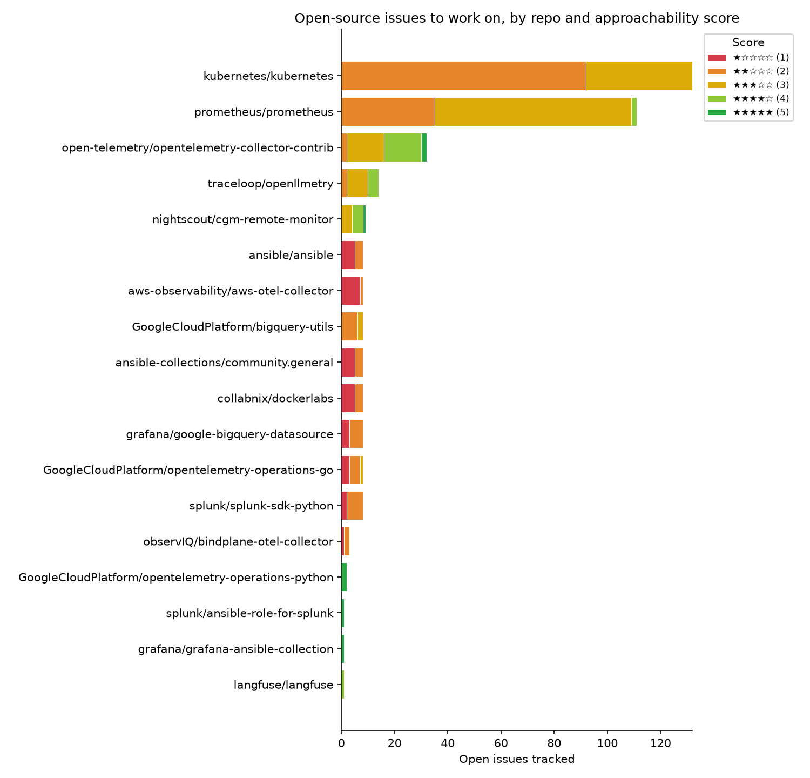
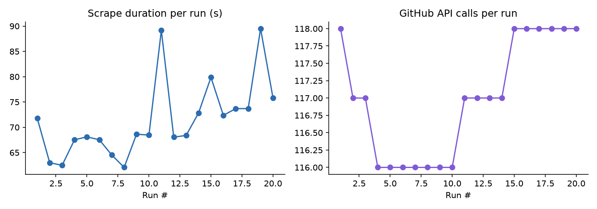

# oss-issue-tracker

[](https://github.com/marly10/oss-issue-tracker/actions/workflows/ci.yml)
[](https://github.com/marly10/oss-issue-tracker/actions/workflows/weekly-scrape.yml)
[](LICENSE)
[](pyproject.toml)

Dynamic contribution radar: scans every repo I've forked, resolves each one's real upstream, pulls its open issues, and scores them by how approachable they are — so I can decide what to work on next without manually digging through issue trackers. Refreshed every Monday by GitHub Actions, with a Slack summary and a chart, not just a wall of markdown.

## Why I built this

I wanted to start contributing to open source in the projects I actually use at work (OpenTelemetry/Bindplane, Grafana's BigQuery datasource, the GCP Terraform provider), but the actual bottleneck wasn't motivation — it was that "go look for a good issue" is a task I'd always defer indefinitely because it required opening ten tabs and skimming label lists. This tool turns that into a five-minute Monday-morning read: one Slack message, one chart, done.

It's also, deliberately, not just a personal script. Anyone can fork this repo, change one line in `config.toml`, and get the same weekly radar pointed at their own GitHub account.

## How it works

```
your forks (GitHub API)
      │
      ▼
resolve each fork's real upstream repo
      │
      ▼
pull open issues from the upstream (retries + rate-limit tracking)
      │
      ▼
score each issue 1-5★ (scoring.py — pure function, unit tested)
      │
      ├──► chart.py    → assets/issues_by_repo.png (stacked bar, by score)
      ├──► metrics.py  → metrics/history.jsonl (structured run telemetry)
      ├──► readme.py   → README.md (atomic write — never a half-written file)
      └──► slack.py    → weekly summary + top picks
```

Every box above is a separate, independently tested module under `src/oss_issue_tracker/` — see [`cli.py`](src/oss_issue_tracker/cli.py) for the orchestration.

## Using this for your own account

1. Fork this repo.
2. Edit `config.toml` — change `username` under `[github]` to yours.
3. Edit `excluded_repos.txt` to skip any forks that aren't real contribution targets (course projects, toy repos, etc).
4. Add a `SLACK_WEBHOOK_URL` repo secret if you want Slack notifications (Settings → Secrets and variables → Actions). Skip this and it just won't notify — everything else still works.
5. The weekly workflow runs automatically. Trigger it manually anytime from the Actions tab if you don't want to wait for Monday.

No code changes needed for a basic fork — that's the point.

## How scoring works

Each issue gets a 1-5★ approachability score, computed in [`scoring.py`](src/oss_issue_tracker/scoring.py) (formula is documented in the function's own docstring, and every branch of it is covered by [`tests/test_scoring.py`](tests/test_scoring.py)):

- `good first issue` / `beginner-friendly` label → +3
- `help wanted` / `up-for-grabs` label → +2
- `bug` or `enhancement` label → +1
- Zero comments (nobody's claimed or debated it) → +1
- More than 10 comments (likely contested or stale) → -1

Repos with no labeled beginner-friendly issues fall back to showing their most recently updated open issues, so quiet repos don't just disappear from the table. Label sets are configurable per-fork in `config.toml`, not hardcoded.

## Engineering notes

A few decisions worth explaining rather than leaving implicit:

- **`tomllib` over a YAML/config dependency.** Config parsing needed exactly one feature (typed key-value config), and Python 3.11+ ships that in the standard library. Pulling in PyYAML for this would be a dependency for a problem already solved.
- **Atomic README writes.** `readme.py` writes to a temp file and `os.replace()`s it into place. If the process dies mid-write (OOM-killed runner, network blip during a later step), the committed README is never left truncated — worst case, the update simply didn't happen this week.
- **Retries live in the HTTP adapter, not sprinkled through business logic.** `github_client.py` configures `urllib3`'s `Retry` once, at the session level, so `chart.py`/`readme.py`/`scoring.py` never need to know the network is unreliable. GitHub's primary rate limit (a 403 with `X-RateLimit-Remaining: 0`) is handled as a distinct case from generic 5xx/429s, since it needs a different response than "retry with backoff" — the run should stop and report it, not hammer an exhausted quota.
- **Structured metrics, human-readable logs — deliberately not the same thing.** Console output during a run is plain text, because its only consumer is a person reading the Actions log. `metrics/history.jsonl` is one structured JSON object per run instead, specifically so it could be ingested by a real metrics pipeline later without a format change. Conflating "what a human wants to read right now" with "what a machine should be able to query later" is a common source of bad logging; this repo keeps them separate on purpose.
- **`excluded_repos.txt` instead of auto-filtering "real" OSS repos.** I could try to heuristically guess which forks are course assignments vs. real contribution targets, but that's a judgment call that belongs to whoever's running the tool, not a heuristic. A plain-text opt-out file keeps that decision explicit and easy to audit.

## Development

```bash
pip install -e ".[dev]"
ruff check .
pytest -v
```

See [CONTRIBUTING.md](CONTRIBUTING.md) for the full contributor workflow — including, fittingly, guidance on what makes a good PR to a tool about making good PRs.

## Tracked issues

<!-- TRACKER:START -->

_Last updated: 2026-10-06 21:17 UTC_

_Tracking **18** upstream repos, **367** relevant open issues._



### [GoogleCloudPlatform/bigquery-utils](https://github.com/GoogleCloudPlatform/bigquery-utils)

| Score | Issue | Labels | Comments | Updated |
|---|---|---|---|---|
| ★★★☆☆ | [#459](https://github.com/GoogleCloudPlatform/bigquery-utils/issues/459) Add Script for On Demand vs. Reservation Analysis | enhancement | 0 | 2024-10-01 |
| ★★★☆☆ | [#5](https://github.com/GoogleCloudPlatform/bigquery-utils/issues/5) Feature Request: Authorized View Generator / Refresher script | enhancement | 0 | 2024-05-29 |
| ★★☆☆☆ | [#518](https://github.com/GoogleCloudPlatform/bigquery-utils/issues/518) bqutil resources are inaccessible via Workload Identity Federation | — | 0 | 2025-12-23 |
| ★★☆☆☆ | [#484](https://github.com/GoogleCloudPlatform/bigquery-utils/issues/484) Add unit testing for colab notebooks | — | 0 | 2025-03-19 |
| ★★☆☆☆ | [#465](https://github.com/GoogleCloudPlatform/bigquery-utils/issues/465) Fix CI/CD pipeline to prevent multiple builds from clobbering cloud storage folders | enhancement | 1 | 2025-01-06 |
| ★★☆☆☆ | [#453](https://github.com/GoogleCloudPlatform/bigquery-utils/issues/453) Unable to find module in theta_sketch.mjs for theta_sketch_int64 | bug | 2 | 2024-12-16 |
| ★★☆☆☆ | [#379](https://github.com/GoogleCloudPlatform/bigquery-utils/issues/379) Missing Datasource for Hourly Utilization Heatmap section | bug | 1 | 2024-10-03 |
| ★★☆☆☆ | [#422](https://github.com/GoogleCloudPlatform/bigquery-utils/issues/422) Add a queries_grouped_by_session.sql script to the optimization/ scripts | enhancement | 1 | 2024-09-18 |

### [GoogleCloudPlatform/opentelemetry-operations-go](https://github.com/GoogleCloudPlatform/opentelemetry-operations-go)

| Score | Issue | Labels | Comments | Updated |
|---|---|---|---|---|
| ★★★☆☆ | [#1038](https://github.com/GoogleCloudPlatform/opentelemetry-operations-go/issues/1038) Disabling the normalizer breaks unknown metrics | bug, priority: p2 | 0 | 2025-05-20 |
| ★★☆☆☆ | [#912](https://github.com/GoogleCloudPlatform/opentelemetry-operations-go/issues/912) Dependency Dashboard | priority: p3, dependencies | 0 | 2026-10-05 |
| ★★☆☆☆ | [#946](https://github.com/GoogleCloudPlatform/opentelemetry-operations-go/issues/946) Add support for tracking metrics with `Cloud Run` resource type | enhancement | 6 | 2026-03-18 |
| ★★☆☆☆ | [#1039](https://github.com/GoogleCloudPlatform/opentelemetry-operations-go/issues/1039) Cloud Trace does not display error span status description | bug, priority: p3, Blocked | 4 | 2025-06-02 |
| ★★☆☆☆ | [#1026](https://github.com/GoogleCloudPlatform/opentelemetry-operations-go/issues/1026) GCP detector ignores context | bug, priority: p1 | 2 | 2025-05-28 |
| ★☆☆☆☆ | [#1099](https://github.com/GoogleCloudPlatform/opentelemetry-operations-go/issues/1099) Migrate googleclientauth extension to use credentials.DetectDefault | — | 1 | 2026-01-26 |
| ★☆☆☆☆ | [#1068](https://github.com/GoogleCloudPlatform/opentelemetry-operations-go/issues/1068) Duplicate label key encountered service_name on trace metrics | — | 22 | 2025-09-29 |
| ★☆☆☆☆ | [#1017](https://github.com/GoogleCloudPlatform/opentelemetry-operations-go/issues/1017) Client metrics for cross-project GCS traffic | — | 6 | 2025-02-19 |

### [GoogleCloudPlatform/opentelemetry-operations-python](https://github.com/GoogleCloudPlatform/opentelemetry-operations-python)

| Score | Issue | Labels | Comments | Updated |
|---|---|---|---|---|
| ★★★★★ | [#357](https://github.com/GoogleCloudPlatform/opentelemetry-operations-python/issues/357) Unsupported metric data type ExponentialHistogram in opentelemetry-exporter-gcp-monitoring | enhancement, good first issue, priority: p2, enhancement accepted | 2 | 2025-06-23 |
| ★★★★★ | [#265](https://github.com/GoogleCloudPlatform/opentelemetry-operations-python/issues/265) Verify non-GKE resources map to `k8s_*` monitored resources | enhancement, good first issue, priority: p2, enhancement accepted | 1 | 2024-08-28 |

### [ansible-collections/community.general](https://github.com/ansible-collections/community.general)

| Score | Issue | Labels | Comments | Updated |
|---|---|---|---|---|
| ★★☆☆☆ | [#12896](https://github.com/ansible-collections/community.general/issues/12896) pkgng: Close stdin of pkg(8) to pick default answers to interactive prompts | bug, module, plugins | 2 | 2026-10-06 |
| ★★☆☆☆ | [#10545](https://github.com/ansible-collections/community.general/issues/10545) diy callback defines deprecated method v2_on_any | bug, callback, has_pr, plugins | 6 | 2026-10-02 |
| ★★☆☆☆ | [#12853](https://github.com/ansible-collections/community.general/issues/12853) ipa_hostgroup fails even if it was successful | bug, module, plugins | 2 | 2026-10-02 |
| ★☆☆☆☆ | [#12897](https://github.com/ansible-collections/community.general/issues/12897) logstash callback plugin: add HTTP(S) transport and authentication | feature, callback, plugins | 2 | 2026-10-06 |
| ★☆☆☆☆ | [#3358](https://github.com/ansible-collections/community.general/issues/3358) TSS: Environment Variables are ignored | bug, lookup, needs_info, plugins | 18 | 2026-10-06 |
| ★☆☆☆☆ | [#12770](https://github.com/ansible-collections/community.general/issues/12770) rpm_info: new module | feature | 3 | 2026-10-05 |
| ★☆☆☆☆ | [#11482](https://github.com/ansible-collections/community.general/issues/11482) Releasing, Versioning and Deprecation (2/N) | admin | 15 | 2026-10-05 |
| ★☆☆☆☆ | [#4699](https://github.com/ansible-collections/community.general/issues/4699) zfs: property values in non-canonical form break idempotency | bug, module, plugins | 12 | 2026-10-04 |

### [ansible/ansible](https://github.com/ansible/ansible)

| Score | Issue | Labels | Comments | Updated |
|---|---|---|---|---|
| ★★☆☆☆ | [#87623](https://github.com/ansible/ansible/issues/87623) Argument spec validation fails for no_log options with non-string defaults | needs_triage, bug, has_pr, pre_release | 7 | 2026-10-06 |
| ★★☆☆☆ | [#87640](https://github.com/ansible/ansible/issues/87640) `IndexError('list index out of range')` gathering `mounts` (from unexpected `lvs` output) | bug, has_pr | 1 | 2026-10-06 |
| ★★☆☆☆ | [#87625](https://github.com/ansible/ansible/issues/87625) Upgrading to 2.22 exposes no_log secrets that 2.21 masked, without a warning | bug, affects_2.22 | 8 | 2026-10-06 |
| ★★☆☆☆ | [#87618](https://github.com/ansible/ansible/issues/87618) Data Tagging: default broken for regular dicts | bug, has_pr, P3 | 3 | 2026-10-06 |
| ★★☆☆☆ | [#85617](https://github.com/ansible/ansible/issues/85617) any_errors_fatal causes hosts to be dropped if rescue occurs in included task | bug, has_pr, P3, verified, affects_2.18 | 3 | 2026-10-06 |
| ★☆☆☆☆ | [#87552](https://github.com/ansible/ansible/issues/87552) `ansible.builtin.first_found` lookup searches different paths if task calls `ansible.builtin.template` module | waiting_on_contributor, feature, affects_2.21 | 4 | 2026-10-06 |
| ★☆☆☆☆ | [#87619](https://github.com/ansible/ansible/issues/87619) Enhance 'ansible.builtin.meta' to provide a standard method for exiting playbooks and terminating workflows | module, feature | 1 | 2026-10-06 |
| ★☆☆☆☆ | [#87577](https://github.com/ansible/ansible/issues/87577) Prevent duplicate key warnings in `ansible.builtin.from_yaml` | has_pr, feature | 3 | 2026-10-06 |

### [aws-observability/aws-otel-collector](https://github.com/aws-observability/aws-otel-collector)

| Score | Issue | Labels | Comments | Updated |
|---|---|---|---|---|
| ★★☆☆☆ | [#3234](https://github.com/aws-observability/aws-otel-collector/issues/3234) Bump golang.org/x/crypto and google.golang.org/grpc for CVE-2026-56854, CVE-2026-84304 and CVE-2026-84445 | — | 0 | 2026-09-25 |
| ★☆☆☆☆ | [#2462](https://github.com/aws-observability/aws-otel-collector/issues/2462) ECS FireLens compatibiltiy: Make it a drop in replacement for aws for fluent bit | logs | 40 | 2026-10-04 |
| ★☆☆☆☆ | [#3162](https://github.com/aws-observability/aws-otel-collector/issues/3162) AWS exporters fail to refresh externally-rotated credentials (e.g., SSM hybrid-activated on-prem instances) | — | 6 | 2026-09-20 |
| ★☆☆☆☆ | [#3213](https://github.com/aws-observability/aws-otel-collector/issues/3213) Need to Upgrade golang.org/x/net & golang.org/x/crypto version | stale | 3 | 2026-09-13 |
| ★☆☆☆☆ | [#3225](https://github.com/aws-observability/aws-otel-collector/issues/3225) awsemf exporter repeatedly fails with PutLogEvents "context deadline exceeded" during startup since ADOT 0.44.0 (works in 0.43.3) | stale | 5 | 2026-09-13 |
| ★☆☆☆☆ | [#1166](https://github.com/aws-observability/aws-otel-collector/issues/1166) spanmetricsprocessor for ADOT | feature-request, ADOT collector, processor | 9 | 2026-03-03 |
| ★☆☆☆☆ | [#556](https://github.com/aws-observability/aws-otel-collector/issues/556) Support host metrics receiver | metrics, feature-request, receiver, ADOT collector | 18 | 2025-02-11 |
| ★☆☆☆☆ | [#821](https://github.com/aws-observability/aws-otel-collector/issues/821) span events doesn't show up in the Xray trace segments | traces, X-Ray | 9 | 2025-01-28 |

### [collabnix/dockerlabs](https://github.com/collabnix/dockerlabs)

| Score | Issue | Labels | Comments | Updated |
|---|---|---|---|---|
| ★★☆☆☆ | [#544](https://github.com/collabnix/dockerlabs/issues/544) A New Modern Look for Docker Labs | — | 0 | 2026-03-25 |
| ★★☆☆☆ | [#452](https://github.com/collabnix/dockerlabs/issues/452) Define journey for Azure, AWS and Google Cloud Engineers | — | 0 | 2022-08-02 |
| ★★☆☆☆ | [#413](https://github.com/collabnix/dockerlabs/issues/413) A weird IP in this HA K8S deployment doc   10.10.40.10   ? | — | 0 | 2022-01-23 |
| ★☆☆☆☆ | [#549](https://github.com/collabnix/dockerlabs/issues/549) PWD lab plaform deprecated | — | 2 | 2026-03-25 |
| ★☆☆☆☆ | [#536](https://github.com/collabnix/dockerlabs/issues/536) docs: Capabilities page - Images can store file-based capabilities | — | 2 | 2024-01-09 |
| ★☆☆☆☆ | [#508](https://github.com/collabnix/dockerlabs/issues/508) [docker] Upgrade labs for cross-platform compatibility | — | 3 | 2023-09-30 |
| ★☆☆☆☆ | [#456](https://github.com/collabnix/dockerlabs/issues/456) Improve Sample Apps section - Add a showcase page | — | 2 | 2023-08-24 |
| ★☆☆☆☆ | [#293](https://github.com/collabnix/dockerlabs/issues/293) Etcd config mistake | — | 2 | 2022-12-02 |

### [grafana/google-bigquery-datasource](https://github.com/grafana/google-bigquery-datasource)

| Score | Issue | Labels | Comments | Updated |
|---|---|---|---|---|
| ★★☆☆☆ | [#414](https://github.com/grafana/google-bigquery-datasource/issues/414) Dependency Dashboard | — | 0 | 2026-10-06 |
| ★★☆☆☆ | [#575](https://github.com/grafana/google-bigquery-datasource/issues/575) [bigquery] Re-enable e2e health check test on cloud | — | 0 | 2026-10-02 |
| ★★☆☆☆ | [#552](https://github.com/grafana/google-bigquery-datasource/issues/552) Incorrect interpolation of single quote for multi-value variable | — | 0 | 2026-08-04 |
| ★★☆☆☆ | [#548](https://github.com/grafana/google-bigquery-datasource/issues/548) Ensure BigQuery is React 19 compatible | — | 0 | 2026-07-24 |
| ★★☆☆☆ | [#533](https://github.com/grafana/google-bigquery-datasource/issues/533) Feature: GCE for Alerting | — | 0 | 2026-06-28 |
| ★★☆☆☆ | [#522](https://github.com/grafana/google-bigquery-datasource/issues/522) Grafana 13.0.2 BigQuery Query Variable definition Field Always Cleared | — | 0 | 2026-06-10 |
| ★☆☆☆☆ | [#502](https://github.com/grafana/google-bigquery-datasource/issues/502) NUMERIC / BIGNUMERIC values lose precision (converted via float64) | — | 2 | 2026-07-04 |
| ★☆☆☆☆ | [#247](https://github.com/grafana/google-bigquery-datasource/issues/247) BigQueryOption `queryPriority` is specified in types, but not passed onto BigQuery client | type/feature-request | 1 | 2026-05-23 |

### [grafana/grafana-ansible-collection](https://github.com/grafana/grafana-ansible-collection)

| Score | Issue | Labels | Comments | Updated |
|---|---|---|---|---|
| ★★★★★ | [#268](https://github.com/grafana/grafana-ansible-collection/issues/268) Add Workflow to Upload collection verion to Ansible Galaxy | good first issue, help wanted | 0 | 2024-09-13 |

### [kubernetes/kubernetes](https://github.com/kubernetes/kubernetes)

| Score | Issue | Labels | Comments | Updated |
|---|---|---|---|---|
| ★★★☆☆ | [#121641](https://github.com/kubernetes/kubernetes/issues/121641) CRD API can accept invalid spec that later the naming controller fails to reconcile | kind/bug, sig/api-machinery, help wanted, triage/accepted | 10 | 2026-10-06 |
| ★★★☆☆ | [#118172](https://github.com/kubernetes/kubernetes/issues/118172) kubelet parameter(eviction-max-pod-grace-period ), not work as expected like officical comment. | kind/bug, priority/backlog, kind/documentation, sig/node, help wanted, priority/important-longterm, good first issue, triage/accepted | 45 | 2026-10-06 |
| ★★★☆☆ | [#112733](https://github.com/kubernetes/kubernetes/issues/112733) Node lifecycle controller does not `markPodsNotReady` when the node `Ready` state changes from `false` to `unknown` | kind/bug, sig/node, help wanted, good first issue, triage/accepted | 36 | 2026-10-06 |
| ★★★☆☆ | [#138149](https://github.com/kubernetes/kubernetes/issues/138149) Migrate DRA components to support granular authorization on status updates | sig/network, sig/node, sig/auth, help wanted, good first issue, triage/accepted, wg/device-management | 83 | 2026-09-30 |
| ★★★☆☆ | [#115823](https://github.com/kubernetes/kubernetes/issues/115823) Give an indication in container events for probe failure as to whether the failure was ignored due to FailureThreshold | priority/backlog, kind/documentation, kind/cleanup, sig/node, help wanted, good first issue, triage/accepted | 24 | 2026-09-28 |
| ★★★☆☆ | [#115782](https://github.com/kubernetes/kubernetes/issues/115782) Write the stress test for gRPC, http, and tcp probes | priority/backlog, kind/cleanup, sig/node, help wanted, good first issue, needs-triage | 47 | 2026-09-28 |
| ★★★☆☆ | [#141819](https://github.com/kubernetes/kubernetes/issues/141819) E2E testing: check for goroutine leaks | kind/feature, help wanted, sig/testing, needs-triage | 7 | 2026-09-07 |
| ★★★☆☆ | [#25836](https://github.com/kubernetes/kubernetes/issues/25836) Audit all APIs for selector fields, ensure documented semantics when nil or empty. | priority/backlog, help wanted, sig/architecture, lifecycle/frozen | 9 | 2026-09-02 |

### [langfuse/langfuse](https://github.com/langfuse/langfuse)

| Score | Issue | Labels | Comments | Updated |
|---|---|---|---|---|
| ★★★★☆ | [#15733](https://github.com/langfuse/langfuse/issues/15733) chore(web): remove expired searchBar feature-preview plumbing (TODO past due 2026-06-19) | good first issue, tech-debt, feat-table-filters, search | 4 | 2026-09-13 |

### [nightscout/cgm-remote-monitor](https://github.com/nightscout/cgm-remote-monitor)

| Score | Issue | Labels | Comments | Updated |
|---|---|---|---|---|
| ★★★★☆ | [#6676](https://github.com/nightscout/cgm-remote-monitor/issues/6676) Horizontal Scrolling with mouse wheel (holding Shift key) | good-first-issue | 1 | 2026-10-05 |
| ★★★★☆ | [#8192](https://github.com/nightscout/cgm-remote-monitor/issues/8192) List items are not scrollable when viewing Food Editor on mobile. | good-first-issue | 2 | 2026-09-30 |
| ★★★★☆ | [#8048](https://github.com/nightscout/cgm-remote-monitor/issues/8048) Clock whit seconds | feature request, good-first-issue | 1 | 2026-06-30 |
| ★★★★☆ | [#7540](https://github.com/nightscout/cgm-remote-monitor/issues/7540) BASE_URL and sub-directories. | good-first-issue | 6 | 2025-07-22 |
| ★★★★☆ | [#7377](https://github.com/nightscout/cgm-remote-monitor/issues/7377) Clock views don't show when token auth is used | clock, good-first-issue | 1 | 2025-05-22 |
| ★★★☆☆ | [#5742](https://github.com/nightscout/cgm-remote-monitor/issues/5742) Custom WebHook Support | help wanted, feature request | 2 | 2026-06-15 |
| ★★★☆☆ | [#6236](https://github.com/nightscout/cgm-remote-monitor/issues/6236) Patchy BG data in Loopalyzer report | bug, help wanted | 15 | 2026-05-05 |
| ★★★☆☆ | [#6061](https://github.com/nightscout/cgm-remote-monitor/issues/6061) REST-API Endpoints for Grafana | help wanted, feature/rest-api | 6 | 2025-05-22 |

### [observIQ/bindplane-otel-collector](https://github.com/observIQ/bindplane-otel-collector)

| Score | Issue | Labels | Comments | Updated |
|---|---|---|---|---|
| ★★☆☆☆ | [#3674](https://github.com/observIQ/bindplane-otel-collector/issues/3674) RPM package fails to install with --prefix: package is not relocatable | — | 0 | 2026-10-01 |
| ★★☆☆☆ | [#3596](https://github.com/observIQ/bindplane-otel-collector/issues/3596) How to handle process stuck in shutdown. | — | 0 | 2026-08-04 |
| ★★☆☆☆ | [#2542](https://github.com/observIQ/bindplane-otel-collector/issues/2542) Add TCP Check receiver | — | 0 | 2025-08-23 |
| ★☆☆☆☆ | [#2296](https://github.com/observIQ/bindplane-otel-collector/issues/2296) install_unix.sh breaks with status code 2 in non-interactive environments | — | 4 | 2026-03-04 |

### [open-telemetry/opentelemetry-collector-contrib](https://github.com/open-telemetry/opentelemetry-collector-contrib)

| Score | Issue | Labels | Comments | Updated |
|---|---|---|---|---|
| ★★★★★ | [#50330](https://github.com/open-telemetry/opentelemetry-collector-contrib/issues/50330) Support component status attributes | enhancement, good first issue, extension/opamp | 5 | 2026-10-04 |
| ★★★★★ | [#48420](https://github.com/open-telemetry/opentelemetry-collector-contrib/issues/48420) [processor/tailsampling] Change default `error_mode` to `ignore` | enhancement, help wanted, good first issue, processor/tailsampling | 5 | 2026-08-17 |
| ★★★★☆ | [#48079](https://github.com/open-telemetry/opentelemetry-collector-contrib/issues/48079) [pkg/pdatatest] New MTS-focused metric assertion framework | enhancement, help wanted, pkg/pdatatest | 2 | 2026-10-06 |
| ★★★★☆ | [#51297](https://github.com/open-telemetry/opentelemetry-collector-contrib/issues/51297) [receiver/azuremonitor] Storage Capacity metrics (BlobCapacity/UsedCapacity) publish with highly variable, undocumented delay per account | good first issue, receiver/azuremonitor | 8 | 2026-10-05 |
| ★★★★☆ | [#46116](https://github.com/open-telemetry/opentelemetry-collector-contrib/issues/46116) [cmd/mdatagen] Move feature gates for metadata.yaml | enhancement, help wanted, good first issue, Stale, priority:p2, cmd/mdatagen | 36 | 2026-10-05 |
| ★★★★☆ | [#39333](https://github.com/open-telemetry/opentelemetry-collector-contrib/issues/39333) Add system.cpu.socket.id and system.cpu.core.id attributes | enhancement, good first issue, processor/resourcedetection, never stale | 14 | 2026-10-03 |
| ★★★★☆ | [#27629](https://github.com/open-telemetry/opentelemetry-collector-contrib/issues/27629) CI/CD: Add label automation to Discussions | enhancement, help wanted, ci-cd, never stale | 6 | 2026-10-03 |
| ★★★★☆ | [#22095](https://github.com/open-telemetry/opentelemetry-collector-contrib/issues/22095) Migrate to latest semconv version and ensure we regularly update going forward | enhancement, good first issue, priority:p2, never stale, component-stability-phase-1 | 27 | 2026-09-30 |

### [prometheus/prometheus](https://github.com/prometheus/prometheus)

| Score | Issue | Labels | Comments | Updated |
|---|---|---|---|---|
| ★★★★☆ | [#14342](https://github.com/prometheus/prometheus/issues/14342) [Remote Write 2.x] Arrow Proto Message Experiment & Benchmark | help wanted, priority/Pmaybe, component/remote storage, not-as-easy-as-it-looks, kind/optimization | 0 | 2024-06-25 |
| ★★★★☆ | [#1220](https://github.com/prometheus/prometheus/issues/1220) Preview alerts in expression browser | help wanted, kind/enhancement, component/ui, priority/P3 | 0 | 2024-02-13 |
| ★★★☆☆ | [#16525](https://github.com/prometheus/prometheus/issues/16525) Set and check (and document) a global label_value_length_limit | help wanted, priority/P3, component/scraping, component/documentation, kind/feature, good first issue | 31 | 2026-09-29 |
| ★★★☆☆ | [#6222](https://github.com/prometheus/prometheus/issues/6222) Promtool subcommands should consistently support stdin reads | help wanted, kind/enhancement, component/promtool, priority/P3, hacktoberfest | 6 | 2026-09-29 |
| ★★★☆☆ | [#11112](https://github.com/prometheus/prometheus/issues/11112) Compactions cause the configured storage.tsdb.retention.size to be exceeded (and risk of running out of disk space) | help wanted, priority/P3, component/tsdb | 8 | 2026-09-29 |
| ★★★☆☆ | [#13657](https://github.com/prometheus/prometheus/issues/13657) Proposal: Cache expanded postings on TSDB | help wanted, kind/enhancement, not-as-easy-as-it-looks, priority/P3, component/tsdb | 3 | 2026-09-28 |
| ★★★☆☆ | [#14349](https://github.com/prometheus/prometheus/issues/14349) [agent] metrics reported by prometheus in agent mode break meta monitoring | help wanted, kind/bug, component/agent | 2 | 2026-09-21 |
| ★★★☆☆ | [#15350](https://github.com/prometheus/prometheus/issues/15350) Add Feature to Set Retention Time per Metric | help wanted, kind/feature | 3 | 2026-09-17 |

### [splunk/ansible-role-for-splunk](https://github.com/splunk/ansible-role-for-splunk)

| Score | Issue | Labels | Comments | Updated |
|---|---|---|---|---|
| ★★★★★ | [#102](https://github.com/splunk/ansible-role-for-splunk/issues/102) Enhancement: Add support to perform rolling upgrades for shc and idx | enhancement, help wanted | 0 | 2021-09-15 |

### [splunk/splunk-sdk-python](https://github.com/splunk/splunk-sdk-python)

| Score | Issue | Labels | Comments | Updated |
|---|---|---|---|---|
| ★★☆☆☆ | [#704](https://github.com/splunk/splunk-sdk-python/issues/704) Unverified SSL context | — | 0 | 2026-09-04 |
| ★★☆☆☆ | [#840](https://github.com/splunk/splunk-sdk-python/issues/840) mcp 2.x compatibility for splunklib.ai | — | 0 | 2026-09-03 |
| ★★☆☆☆ | [#828](https://github.com/splunk/splunk-sdk-python/issues/828) Search Result Export with SSL off doesn't work | — | 0 | 2026-08-18 |
| ★★☆☆☆ | [#785](https://github.com/splunk/splunk-sdk-python/issues/785) Splunk core -> python3.13 | — | 0 | 2026-05-13 |
| ★★☆☆☆ | [#687](https://github.com/splunk/splunk-sdk-python/issues/687) Custom command have high CPU load / RAM usage | bug, Custom Search Commands | 1 | 2026-03-20 |
| ★★☆☆☆ | [#617](https://github.com/splunk/splunk-sdk-python/issues/617) Question - High performing and high scale KVstore content retrieval with the Splunk Python SDK | bug, KV Store | 2 | 2025-11-13 |
| ★☆☆☆☆ | [#835](https://github.com/splunk/splunk-sdk-python/issues/835) connect() fails on FIPS-enabled Splunk 10.4.x: unguarded ctx.set_groups() raises ssl.SSLError (_ssl.c:4981) before any connection is attempted | — | 1 | 2026-09-08 |
| ★☆☆☆☆ | [#831](https://github.com/splunk/splunk-sdk-python/issues/831) `SPLUNK_HOME` absolute-path check in `splunklib.ai.tools` fails on Windows | — | 1 | 2026-08-19 |

### [traceloop/openllmetry](https://github.com/traceloop/openllmetry)

| Score | Issue | Labels | Comments | Updated |
|---|---|---|---|---|
| ★★★★☆ | [#417](https://github.com/traceloop/openllmetry/issues/417) 🐛 Bug Report: disabled tests for GCP / VertexAI | good first issue, help wanted, testing | 8 | 2026-09-21 |
| ★★★★☆ | [#2303](https://github.com/traceloop/openllmetry/issues/2303) 🚀 Feature: Support for Azure AI Search | enhancement, good first issue, help wanted | 16 | 2026-05-18 |
| ★★★★☆ | [#2283](https://github.com/traceloop/openllmetry/issues/2283) 🚀 Feature: Add instruments support for httpx | enhancement, good first issue | 11 | 2025-11-06 |
| ★★★☆☆ | [#4069](https://github.com/traceloop/openllmetry/issues/4069) 🚀 Feature: Suggestion: Add beginner-friendly example for LLM tracing | good first issue | 15 | 2026-10-04 |
| ★★★☆☆ | [#3492](https://github.com/traceloop/openllmetry/issues/3492) 🐛 Bug Report: `opentelemetry-instrumentation-qdrant` is incompatible with `qdrant-client` version `1.16.1` | good first issue, help wanted | 13 | 2026-09-13 |
| ★★★☆☆ | [#785](https://github.com/traceloop/openllmetry/issues/785) 🚀 Feature: Support runpod.ai | help wanted, new instrumentation | 4 | 2026-08-19 |
| ★★★☆☆ | [#2803](https://github.com/traceloop/openllmetry/issues/2803) 🚀 Feature: Install less packages | good first issue, help wanted | 19 | 2026-06-08 |
| ★★★☆☆ | [#1618](https://github.com/traceloop/openllmetry/issues/1618) 🚀 Feature: Support new Pinecone APIs | good first issue, help wanted | 12 | 2026-05-18 |


<!-- TRACKER:END -->

## Run metrics

<!-- METRICS:START -->

_Last run: 2026-10-06 21:15 UTC, took **72.4s**, **118** GitHub API calls, **4882/5000** rate limit remaining._



<!-- METRICS:END -->

## License

[MIT](LICENSE)
