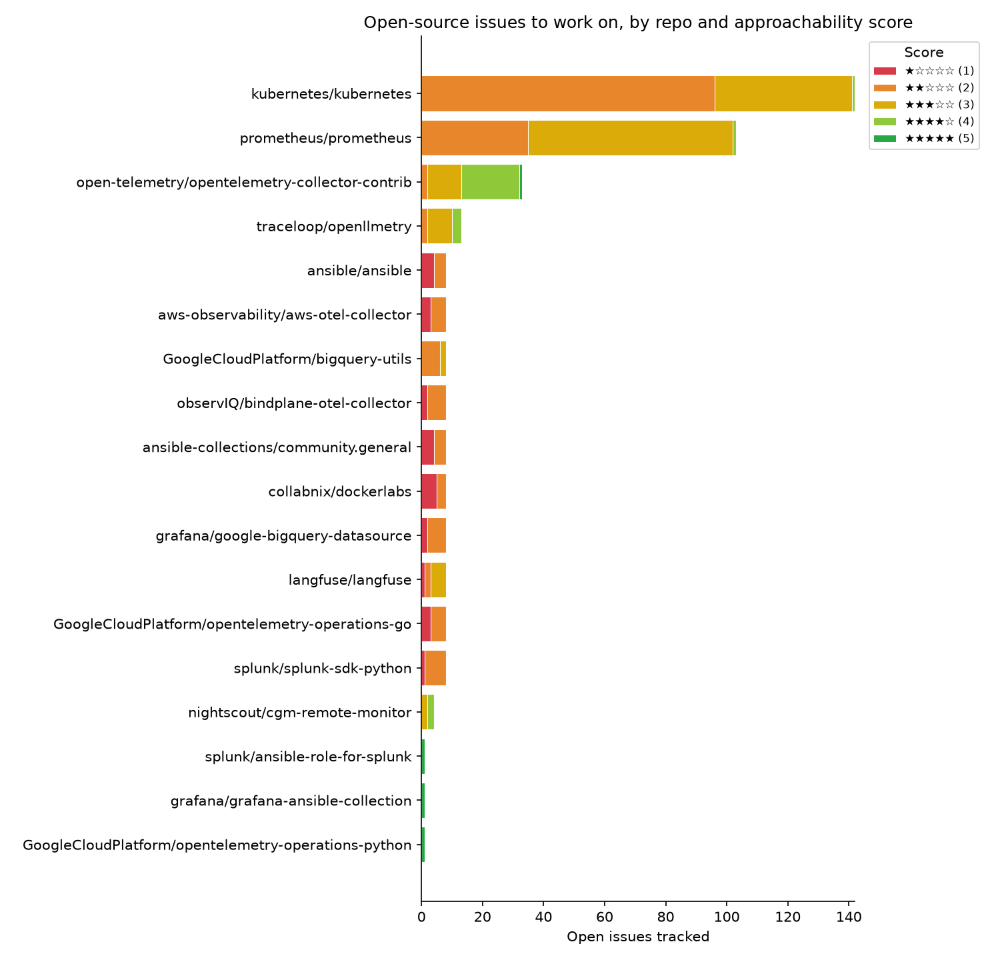

# oss-issue-tracker

[](https://github.com/marly10/oss-issue-tracker/actions/workflows/ci.yml)
[](https://github.com/marly10/oss-issue-tracker/actions/workflows/weekly-scrape.yml)
[](LICENSE)
[](pyproject.toml)

Dynamic contribution radar: scans every repo I've forked, resolves each one's real upstream, pulls its open issues, and scores them by how approachable they are — so I can decide what to work on next without manually digging through issue trackers. Refreshed every Monday by GitHub Actions, with a Slack summary and a chart, not just a wall of markdown.

## Why I built this

I wanted to start contributing to open source in the projects I actually use at work (OpenTelemetry/Bindplane, Grafana's BigQuery datasource, the GCP Terraform provider), but the actual bottleneck wasn't motivation — it was that "go look for a good issue" is a task I'd always defer indefinitely because it required opening ten tabs and skimming label lists. This tool turns that into a five-minute Monday-morning read: one Slack message, one chart, done.

It's also, deliberately, not just a personal script. Anyone can fork this repo, change one line in `config.toml`, and get the same weekly radar pointed at their own GitHub account.

## How it works

```
your forks (GitHub API)
      │
      ▼
resolve each fork's real upstream repo
      │
      ▼
pull open issues from the upstream (retries + rate-limit tracking)
      │
      ▼
score each issue 1-5★ (scoring.py — pure function, unit tested)
      │
      ├──► chart.py    → assets/issues_by_repo.png (stacked bar, by score)
      ├──► metrics.py  → metrics/history.jsonl (structured run telemetry)
      ├──► readme.py   → README.md (atomic write — never a half-written file)
      └──► slack.py    → weekly summary + top picks
```

Every box above is a separate, independently tested module under `src/oss_issue_tracker/` — see [`cli.py`](src/oss_issue_tracker/cli.py) for the orchestration.

## Using this for your own account

1. Fork this repo.
2. Edit `config.toml` — change `username` under `[github]` to yours.
3. Edit `excluded_repos.txt` to skip any forks that aren't real contribution targets (course projects, toy repos, etc).
4. Add a `SLACK_WEBHOOK_URL` repo secret if you want Slack notifications (Settings → Secrets and variables → Actions). Skip this and it just won't notify — everything else still works.
5. The weekly workflow runs automatically. Trigger it manually anytime from the Actions tab if you don't want to wait for Monday.

No code changes needed for a basic fork — that's the point.

## How scoring works

Each issue gets a 1-5★ approachability score, computed in [`scoring.py`](src/oss_issue_tracker/scoring.py) (formula is documented in the function's own docstring, and every branch of it is covered by [`tests/test_scoring.py`](tests/test_scoring.py)):

- `good first issue` / `beginner-friendly` label → +3
- `help wanted` / `up-for-grabs` label → +2
- `bug` or `enhancement` label → +1
- Zero comments (nobody's claimed or debated it) → +1
- More than 10 comments (likely contested or stale) → -1

Repos with no labeled beginner-friendly issues fall back to showing their most recently updated open issues, so quiet repos don't just disappear from the table. Label sets are configurable per-fork in `config.toml`, not hardcoded.

## Engineering notes

A few decisions worth explaining rather than leaving implicit:

- **`tomllib` over a YAML/config dependency.** Config parsing needed exactly one feature (typed key-value config), and Python 3.11+ ships that in the standard library. Pulling in PyYAML for this would be a dependency for a problem already solved.
- **Atomic README writes.** `readme.py` writes to a temp file and `os.replace()`s it into place. If the process dies mid-write (OOM-killed runner, network blip during a later step), the committed README is never left truncated — worst case, the update simply didn't happen this week.
- **Retries live in the HTTP adapter, not sprinkled through business logic.** `github_client.py` configures `urllib3`'s `Retry` once, at the session level, so `chart.py`/`readme.py`/`scoring.py` never need to know the network is unreliable. GitHub's primary rate limit (a 403 with `X-RateLimit-Remaining: 0`) is handled as a distinct case from generic 5xx/429s, since it needs a different response than "retry with backoff" — the run should stop and report it, not hammer an exhausted quota.
- **Structured metrics, human-readable logs — deliberately not the same thing.** Console output during a run is plain text, because its only consumer is a person reading the Actions log. `metrics/history.jsonl` is one structured JSON object per run instead, specifically so it could be ingested by a real metrics pipeline later without a format change. Conflating "what a human wants to read right now" with "what a machine should be able to query later" is a common source of bad logging; this repo keeps them separate on purpose.
- **`excluded_repos.txt` instead of auto-filtering "real" OSS repos.** I could try to heuristically guess which forks are course assignments vs. real contribution targets, but that's a judgment call that belongs to whoever's running the tool, not a heuristic. A plain-text opt-out file keeps that decision explicit and easy to audit.

## Development

```bash
pip install -e ".[dev]"
ruff check .
pytest -v
```

See [CONTRIBUTING.md](CONTRIBUTING.md) for the full contributor workflow — including, fittingly, guidance on what makes a good PR to a tool about making good PRs.

## Tracked issues

<!-- TRACKER:START -->

_Last updated: 2026-11-19 22:24 UTC_

_Tracking **18** upstream repos, **376** relevant open issues._



### [GoogleCloudPlatform/bigquery-utils](https://github.com/GoogleCloudPlatform/bigquery-utils)

| Score | Issue | Labels | Comments | Updated |
|---|---|---|---|---|
| ★★★☆☆ | [#459](https://github.com/GoogleCloudPlatform/bigquery-utils/issues/459) Add Script for On Demand vs. Reservation Analysis | enhancement | 0 | 2024-10-01 |
| ★★★☆☆ | [#5](https://github.com/GoogleCloudPlatform/bigquery-utils/issues/5) Feature Request: Authorized View Generator / Refresher script | enhancement | 0 | 2024-05-29 |
| ★★☆☆☆ | [#518](https://github.com/GoogleCloudPlatform/bigquery-utils/issues/518) bqutil resources are inaccessible via Workload Identity Federation | — | 0 | 2025-12-23 |
| ★★☆☆☆ | [#484](https://github.com/GoogleCloudPlatform/bigquery-utils/issues/484) Add unit testing for colab notebooks | — | 0 | 2025-03-19 |
| ★★☆☆☆ | [#465](https://github.com/GoogleCloudPlatform/bigquery-utils/issues/465) Fix CI/CD pipeline to prevent multiple builds from clobbering cloud storage folders | enhancement | 1 | 2025-01-06 |
| ★★☆☆☆ | [#453](https://github.com/GoogleCloudPlatform/bigquery-utils/issues/453) Unable to find module in theta_sketch.mjs for theta_sketch_int64 | bug | 2 | 2024-12-16 |
| ★★☆☆☆ | [#379](https://github.com/GoogleCloudPlatform/bigquery-utils/issues/379) Missing Datasource for Hourly Utilization Heatmap section | bug | 1 | 2024-10-03 |
| ★★☆☆☆ | [#422](https://github.com/GoogleCloudPlatform/bigquery-utils/issues/422) Add a queries_grouped_by_session.sql script to the optimization/ scripts | enhancement | 1 | 2024-09-18 |

### [GoogleCloudPlatform/opentelemetry-operations-go](https://github.com/GoogleCloudPlatform/opentelemetry-operations-go)

| Score | Issue | Labels | Comments | Updated |
|---|---|---|---|---|
| ★★☆☆☆ | [#912](https://github.com/GoogleCloudPlatform/opentelemetry-operations-go/issues/912) Dependency Dashboard | priority: p3, dependencies | 0 | 2026-11-19 |
| ★★☆☆☆ | [#1038](https://github.com/GoogleCloudPlatform/opentelemetry-operations-go/issues/1038) Disabling the normalizer breaks unknown metrics | bug, priority: p2 | 1 | 2026-11-03 |
| ★★☆☆☆ | [#1039](https://github.com/GoogleCloudPlatform/opentelemetry-operations-go/issues/1039) Cloud Trace does not display error span status description | bug, priority: p3, Blocked | 4 | 2025-06-02 |
| ★★☆☆☆ | [#733](https://github.com/GoogleCloudPlatform/opentelemetry-operations-go/issues/733) Remove HTTP method from span name | enhancement, priority: p2 | 5 | 2024-01-31 |
| ★★☆☆☆ | [#707](https://github.com/GoogleCloudPlatform/opentelemetry-operations-go/issues/707) Add metrics for export RPCs | enhancement, priority: p2 | 4 | 2023-08-15 |
| ★☆☆☆☆ | [#1068](https://github.com/GoogleCloudPlatform/opentelemetry-operations-go/issues/1068) Duplicate label key encountered service_name on trace metrics | — | 22 | 2025-09-29 |
| ★☆☆☆☆ | [#1017](https://github.com/GoogleCloudPlatform/opentelemetry-operations-go/issues/1017) Client metrics for cross-project GCS traffic | — | 6 | 2025-02-19 |
| ★☆☆☆☆ | [#443](https://github.com/GoogleCloudPlatform/opentelemetry-operations-go/issues/443) Exporter time series errors do not include metric names | enhancement, priority: p2 | 13 | 2023-08-14 |

### [GoogleCloudPlatform/opentelemetry-operations-python](https://github.com/GoogleCloudPlatform/opentelemetry-operations-python)

| Score | Issue | Labels | Comments | Updated |
|---|---|---|---|---|
| ★★★★★ | [#357](https://github.com/GoogleCloudPlatform/opentelemetry-operations-python/issues/357) Unsupported metric data type ExponentialHistogram in opentelemetry-exporter-gcp-monitoring | enhancement, good first issue, priority: p2, enhancement accepted | 2 | 2025-06-23 |

### [ansible-collections/community.general](https://github.com/ansible-collections/community.general)

| Score | Issue | Labels | Comments | Updated |
|---|---|---|---|---|
| ★★☆☆☆ | [#13315](https://github.com/ansible-collections/community.general/issues/13315) Module java_cert does not behave correctly when removing a key from a keystore | bug, module, plugins | 2 | 2026-11-19 |
| ★★☆☆☆ | [#3782](https://github.com/ansible-collections/community.general/issues/3782) Scaleway organization list is broken in scaleway_organization_info | bug, module, has_pr, plugins, cloud | 7 | 2026-11-18 |
| ★★☆☆☆ | [#715](https://github.com/ansible-collections/community.general/issues/715) redhat_subscription fails when Satellite uses Simple Content Access | bug, module, has_pr, needs_triage, plugins, python3, os, packaging, redhat_subscription | 6 | 2026-11-17 |
| ★★☆☆☆ | [#10056](https://github.com/ansible-collections/community.general/issues/10056) [lvol] Module hangs after resizing metadata volume despite success | bug, module, needs_info, plugins | 3 | 2026-11-17 |
| ★★☆☆☆ | [#13243](https://github.com/ansible-collections/community.general/issues/13243) redis_data always reports changed when the key already has the desired value | bug, module, plugins | 5 | 2026-11-16 |
| ★☆☆☆☆ | [#13313](https://github.com/ansible-collections/community.general/issues/13313) community.general.incus file name requirements documentation | connection, plugins, docs | 2 | 2026-11-18 |
| ★☆☆☆☆ | [#13307](https://github.com/ansible-collections/community.general/issues/13307) flatpak: add bundle support | feature, module, plugins | 2 | 2026-11-18 |
| ★☆☆☆☆ | [#8217](https://github.com/ansible-collections/community.general/issues/8217) Unable to to specify a specific package version in Ansible for apt_rpm module | feature, module, has_pr, plugins | 20 | 2026-11-16 |

### [ansible/ansible](https://github.com/ansible/ansible)

| Score | Issue | Labels | Comments | Updated |
|---|---|---|---|---|
| ★★☆☆☆ | [#87934](https://github.com/ansible/ansible/issues/87934) local connection reports a wrong become password as "Duplicate become password prompt encountered" | waiting_on_contributor, bug, affects_2.20 | 3 | 2026-11-19 |
| ★★☆☆☆ | [#87930](https://github.com/ansible/ansible/issues/87930) Plugin loader finds (some?) plugins under incorrect names as well | bug, P3 | 3 | 2026-11-19 |
| ★★☆☆☆ | [#87921](https://github.com/ansible/ansible/issues/87921) apt: update_cache fails with an empty reason when apt reports a failed download only as warnings | module, bug, has_pr, affects_2.22 | 1 | 2026-11-19 |
| ★★☆☆☆ | [#87920](https://github.com/ansible/ansible/issues/87920) $REDACTED$ in role names in the console output gives away possible secrets | bug, affects_2.22 | 4 | 2026-11-19 |
| ★★☆☆☆ | [#87941](https://github.com/ansible/ansible/issues/87941) ansible-connection: persistent connection daemon closes its listening socket with a client request already queued, causing intermittent ECONNRESET | networking, needs_triage, bug, affects_2.20 | 2 | 2026-11-19 |
| ★★☆☆☆ | [#74237](https://github.com/ansible/ansible/issues/74237) wait_for_connection ignores short timeouts | module, bug, has_pr, P3, verified, affects_2.10 | 8 | 2026-11-19 |
| ★★☆☆☆ | [#87910](https://github.com/ansible/ansible/issues/87910) Play output unreadable: integers in a vaulted list are stripped from hostnames | bug, affects_2.22 | 6 | 2026-11-18 |
| ★★☆☆☆ | [#87881](https://github.com/ansible/ansible/issues/87881) ansible.builtin.git: 'NoneType' object has no attribute 'startswith' | module, bug, affects_2.21 | 5 | 2026-11-18 |

### [aws-observability/aws-otel-collector](https://github.com/aws-observability/aws-otel-collector)

| Score | Issue | Labels | Comments | Updated |
|---|---|---|---|---|
| ★★☆☆☆ | [#3245](https://github.com/aws-observability/aws-otel-collector/issues/3245) Add AWS Application Signals (awsapplicationsignals) processor to ADOT Collector | — | 0 | 2026-10-26 |
| ★★☆☆☆ | [#3241](https://github.com/aws-observability/aws-otel-collector/issues/3241) Rebuild release artifacts with patched Go for eMudhra CA distrust (CVE-2026-111943) | — | 0 | 2026-10-23 |
| ★★☆☆☆ | [#3239](https://github.com/aws-observability/aws-otel-collector/issues/3239) Add prometheusremotewritereceiver to ADOT Collector | — | 0 | 2026-10-22 |
| ★★☆☆☆ | [#3240](https://github.com/aws-observability/aws-otel-collector/issues/3240) Update method for verifying deb signatures | — | 0 | 2026-10-22 |
| ★★☆☆☆ | [#3234](https://github.com/aws-observability/aws-otel-collector/issues/3234) Bump golang.org/x/crypto and google.golang.org/grpc for CVE-2026-56854, CVE-2026-84304 and CVE-2026-84445 | — | 0 | 2026-09-25 |
| ★☆☆☆☆ | [#2462](https://github.com/aws-observability/aws-otel-collector/issues/2462) ECS FireLens compatibiltiy: Make it a drop in replacement for aws for fluent bit | logs | 40 | 2026-10-04 |
| ★☆☆☆☆ | [#3162](https://github.com/aws-observability/aws-otel-collector/issues/3162) AWS exporters fail to refresh externally-rotated credentials (e.g., SSM hybrid-activated on-prem instances) | — | 6 | 2026-09-20 |
| ★☆☆☆☆ | [#1166](https://github.com/aws-observability/aws-otel-collector/issues/1166) spanmetricsprocessor for ADOT | feature-request, ADOT collector, processor | 9 | 2026-03-03 |

### [collabnix/dockerlabs](https://github.com/collabnix/dockerlabs)

| Score | Issue | Labels | Comments | Updated |
|---|---|---|---|---|
| ★★☆☆☆ | [#544](https://github.com/collabnix/dockerlabs/issues/544) A New Modern Look for Docker Labs | — | 0 | 2026-03-25 |
| ★★☆☆☆ | [#452](https://github.com/collabnix/dockerlabs/issues/452) Define journey for Azure, AWS and Google Cloud Engineers | — | 0 | 2022-08-02 |
| ★★☆☆☆ | [#413](https://github.com/collabnix/dockerlabs/issues/413) A weird IP in this HA K8S deployment doc   10.10.40.10   ? | — | 0 | 2022-01-23 |
| ★☆☆☆☆ | [#549](https://github.com/collabnix/dockerlabs/issues/549) PWD lab plaform deprecated | — | 2 | 2026-03-25 |
| ★☆☆☆☆ | [#536](https://github.com/collabnix/dockerlabs/issues/536) docs: Capabilities page - Images can store file-based capabilities | — | 2 | 2024-01-09 |
| ★☆☆☆☆ | [#508](https://github.com/collabnix/dockerlabs/issues/508) [docker] Upgrade labs for cross-platform compatibility | — | 3 | 2023-09-30 |
| ★☆☆☆☆ | [#456](https://github.com/collabnix/dockerlabs/issues/456) Improve Sample Apps section - Add a showcase page | — | 2 | 2023-08-24 |
| ★☆☆☆☆ | [#293](https://github.com/collabnix/dockerlabs/issues/293) Etcd config mistake | — | 2 | 2022-12-02 |

### [grafana/google-bigquery-datasource](https://github.com/grafana/google-bigquery-datasource)

| Score | Issue | Labels | Comments | Updated |
|---|---|---|---|---|
| ★★☆☆☆ | [#414](https://github.com/grafana/google-bigquery-datasource/issues/414) Dependency Dashboard | — | 0 | 2026-11-19 |
| ★★☆☆☆ | [#575](https://github.com/grafana/google-bigquery-datasource/issues/575) [bigquery] Re-enable e2e health check test on cloud | — | 0 | 2026-10-02 |
| ★★☆☆☆ | [#552](https://github.com/grafana/google-bigquery-datasource/issues/552) Incorrect interpolation of single quote for multi-value variable | — | 0 | 2026-08-04 |
| ★★☆☆☆ | [#548](https://github.com/grafana/google-bigquery-datasource/issues/548) Ensure BigQuery is React 19 compatible | — | 0 | 2026-07-24 |
| ★★☆☆☆ | [#533](https://github.com/grafana/google-bigquery-datasource/issues/533) Feature: GCE for Alerting | — | 0 | 2026-06-28 |
| ★★☆☆☆ | [#522](https://github.com/grafana/google-bigquery-datasource/issues/522) Grafana 13.0.2 BigQuery Query Variable definition Field Always Cleared | — | 0 | 2026-06-10 |
| ★☆☆☆☆ | [#322](https://github.com/grafana/google-bigquery-datasource/issues/322) Streaming JSON parser for Big Query | stale | 3 | 2026-11-07 |
| ★☆☆☆☆ | [#502](https://github.com/grafana/google-bigquery-datasource/issues/502) NUMERIC / BIGNUMERIC values lose precision (converted via float64) | — | 2 | 2026-07-04 |

### [grafana/grafana-ansible-collection](https://github.com/grafana/grafana-ansible-collection)

| Score | Issue | Labels | Comments | Updated |
|---|---|---|---|---|
| ★★★★★ | [#268](https://github.com/grafana/grafana-ansible-collection/issues/268) Add Workflow to Upload collection verion to Ansible Galaxy | good first issue, help wanted | 0 | 2024-09-13 |

### [kubernetes/kubernetes](https://github.com/kubernetes/kubernetes)

| Score | Issue | Labels | Comments | Updated |
|---|---|---|---|---|
| ★★★★☆ | [#144333](https://github.com/kubernetes/kubernetes/issues/144333) retry.OnErrorWithContext / retry.RetryOnConflictWithContext | sig/api-machinery, help wanted, good first issue, needs-triage | 4 | 2026-11-19 |
| ★★★☆☆ | [#138149](https://github.com/kubernetes/kubernetes/issues/138149) Migrate DRA components to support granular authorization on status updates | sig/network, sig/node, sig/auth, help wanted, good first issue, triage/accepted, wg/device-management | 99 | 2026-11-18 |
| ★★★☆☆ | [#144300](https://github.com/kubernetes/kubernetes/issues/144300) [Flaking Test] LocalStorageCapacityIsolationEviction: clean-exit emptyDir container exits 137, expected 0 | sig/node, kind/flake, help wanted, priority/important-longterm, triage/accepted | 5 | 2026-11-18 |
| ★★★☆☆ | [#144302](https://github.com/kubernetes/kubernetes/issues/144302) [Flaking Test] PodResources metrics: List() gets connection refused on the kubelet socket | sig/node, kind/flake, help wanted, priority/important-longterm, triage/accepted | 5 | 2026-11-18 |
| ★★★☆☆ | [#118172](https://github.com/kubernetes/kubernetes/issues/118172) kubelet parameter(eviction-max-pod-grace-period ), not work as expected like officical comment. | kind/bug, priority/backlog, kind/documentation, sig/node, help wanted, priority/important-longterm, good first issue, triage/accepted | 48 | 2026-11-10 |
| ★★★☆☆ | [#120677](https://github.com/kubernetes/kubernetes/issues/120677) Test Audit policy using original (non-impersonated) user for filtering | sig/auth, help wanted, triage/accepted | 8 | 2026-11-01 |
| ★★★☆☆ | [#141200](https://github.com/kubernetes/kubernetes/issues/141200) [Flaking Test] [sig-node] [Feature:GPUDevicePlugin] Sanity test using nvidia-smi [Provider:aws,gce] should run nvidia-smi and cuda-demo-suite [Serial] | sig/node, kind/flake, help wanted, priority/important-longterm, triage/accepted | 8 | 2026-10-24 |
| ★★★☆☆ | [#133877](https://github.com/kubernetes/kubernetes/issues/133877) Prevent duplicate initializations of cache and etcd store | kind/bug, sig/api-machinery, help wanted, triage/accepted | 5 | 2026-10-24 |

### [langfuse/langfuse](https://github.com/langfuse/langfuse)

| Score | Issue | Labels | Comments | Updated |
|---|---|---|---|---|
| ★★☆☆☆ | [#20536](https://github.com/langfuse/langfuse/issues/20536) docs(v4): re-exported span IDs with the same start_time collapse to the last-processed write, not duplicates | docs, improvement, feat-otel, feat-ingestion | 0 | 2026-11-19 |
| ★★☆☆☆ | [#20531](https://github.com/langfuse/langfuse/issues/20531) Proposal: Federated MCP tools with server-side tool bundles | feature, feat-mcp | 0 | 2026-11-19 |
| ★★☆☆☆ | [#20149](https://github.com/langfuse/langfuse/issues/20149) bug(pricing): Bedrock in-Region and geographic Claude ids priced at the global rate (10% low) | bug, feat-llm-cost-tracking, feat-models, unconfirmed-bug | 2 | 2026-11-19 |
| ★★☆☆☆ | [#18572](https://github.com/langfuse/langfuse/issues/18572) bug: recurring Worker Redis socket timeouts; upstream ioredis reconnect fix not included | bug, self-hosting, stale, infra | 3 | 2026-11-19 |
| ★★☆☆☆ | [#16501](https://github.com/langfuse/langfuse/issues/16501) security: Auth endpoints (signup + credentials login) have no application-level rate limiting | bug, feat-auth, security, AI commented, needs-grilling | 3 | 2026-11-19 |
| ★★☆☆☆ | [#18834](https://github.com/langfuse/langfuse/issues/18834) bug: Worker S3 downloads fail with `ECONNRESET: socket hang up` on v3.225.11 (stale keep-alive sockets); not seen on v3.171.0 | bug, stale, integration-s3 | 3 | 2026-11-19 |
| ★☆☆☆☆ | [#20406](https://github.com/langfuse/langfuse/issues/20406) Instance-wide (global) custom models and prices for self-hosted deployments | feat-api, feat-llm-cost-tracking, feat-models, feature | 2 | 2026-11-19 |
| ★☆☆☆☆ | [#12738](https://github.com/langfuse/langfuse/issues/12738) MCP Server: Support SSO/OIDC authentication as alternative to static API keys | feat-auth, integration-mcp-server, feature | 49 | 2026-11-19 |

### [nightscout/cgm-remote-monitor](https://github.com/nightscout/cgm-remote-monitor)

| Score | Issue | Labels | Comments | Updated |
|---|---|---|---|---|
| ★★★★☆ | [#6676](https://github.com/nightscout/cgm-remote-monitor/issues/6676) Horizontal Scrolling with mouse wheel (holding Shift key) | good-first-issue | 1 | 2026-10-05 |
| ★★★★☆ | [#7540](https://github.com/nightscout/cgm-remote-monitor/issues/7540) BASE_URL and sub-directories. | good-first-issue | 6 | 2025-07-22 |
| ★★★☆☆ | [#5742](https://github.com/nightscout/cgm-remote-monitor/issues/5742) Custom WebHook Support | help wanted, feature request | 2 | 2026-06-15 |
| ★★★☆☆ | [#6028](https://github.com/nightscout/cgm-remote-monitor/issues/6028) Loopalyzer report has missing Active insulin rendering for some days | help wanted | 4 | 2020-10-14 |

### [observIQ/bindplane-otel-collector](https://github.com/observIQ/bindplane-otel-collector)

| Score | Issue | Labels | Comments | Updated |
|---|---|---|---|---|
| ★★☆☆☆ | [#3814](https://github.com/observIQ/bindplane-otel-collector/issues/3814) Mirror from DBDOT: chore: v1.4.0 release prep (#148) | dbdot-mirror-issue | 0 | 2026-11-19 |
| ★★☆☆☆ | [#3812](https://github.com/observIQ/bindplane-otel-collector/issues/3812) Mirror from DBDOT: deps: update dependency goreleaser/goreleaser to v2.20.2 (#141) | dbdot-mirror-issue | 0 | 2026-11-18 |
| ★★☆☆☆ | [#3811](https://github.com/observIQ/bindplane-otel-collector/issues/3811) Mirror from DBDOT: chore(release): publish full build images from the release pipeline (#136) | dbdot-mirror-issue | 0 | 2026-11-18 |
| ★★☆☆☆ | [#3804](https://github.com/observIQ/bindplane-otel-collector/issues/3804) Mirror from DBDOT: deps: update go non-major deps (#143) | dbdot-mirror-issue | 0 | 2026-11-17 |
| ★★☆☆☆ | [#3803](https://github.com/observIQ/bindplane-otel-collector/issues/3803) Mirror from DBDOT: deps: update alpine:3.24 docker digest to f59abe6 (#140) | dbdot-mirror-issue | 0 | 2026-11-17 |
| ★★☆☆☆ | [#3802](https://github.com/observIQ/bindplane-otel-collector/issues/3802) Mirror from DBDOT: deps: pin dependencies (#139) | dbdot-mirror-issue | 0 | 2026-11-17 |
| ★★☆☆☆ | [#3799](https://github.com/observIQ/bindplane-otel-collector/issues/3799) Mirror from DBDOT: chore(ci): gate changes to the collector's Go runtime fingerprint (BP-363) (#130) | dbdot-mirror-issue | 0 | 2026-11-17 |
| ★★☆☆☆ | [#3798](https://github.com/observIQ/bindplane-otel-collector/issues/3798) Mirror from DBDOT: feat: log Go runtime CPU settings at startup and warn on GOMAXPROCS overcommit (BP-360) (#129) | dbdot-mirror-issue | 0 | 2026-11-17 |

### [open-telemetry/opentelemetry-collector-contrib](https://github.com/open-telemetry/opentelemetry-collector-contrib)

| Score | Issue | Labels | Comments | Updated |
|---|---|---|---|---|
| ★★★★★ | [#52946](https://github.com/open-telemetry/opentelemetry-collector-contrib/issues/52946) [pkg/ottl] Comparing two values of the same uncomparable type panics and crashes the collector | bug, good first issue, priority:p0, pkg/ottl | 6 | 2026-11-19 |
| ★★★★☆ | [#52039](https://github.com/open-telemetry/opentelemetry-collector-contrib/issues/52039) [internal/kafka] Deprecate `AWS_MSK_IAM_OAUTHBEARER` | good first issue, extension/sigv4auth, internal/kafka | 9 | 2026-11-19 |
| ★★★★☆ | [#52964](https://github.com/open-telemetry/opentelemetry-collector-contrib/issues/52964) [receiver/sqlquery] README examples use `user` instead of `username` | documentation, good first issue, receiver/sqlquery, Contribfest | 4 | 2026-11-19 |
| ★★★★☆ | [#51982](https://github.com/open-telemetry/opentelemetry-collector-contrib/issues/51982) [receiver/k8sevents] watch stalls forever without logging: RetryWatcher retries every second and the observer never re-lists | bug, help wanted, receiver/k8sevents, internal/k8sinventory | 6 | 2026-11-19 |
| ★★★★☆ | [#52962](https://github.com/open-telemetry/opentelemetry-collector-contrib/issues/52962) [CI CD] consider running AIX build and tests with a label | help wanted, good first issue, ci-cd | 3 | 2026-11-16 |
| ★★★★☆ | [#52914](https://github.com/open-telemetry/opentelemetry-collector-contrib/issues/52914) [extension/avro_log_encoding] Unmaintained component | help wanted, unmaintained | 0 | 2026-11-10 |
| ★★★★☆ | [#52509](https://github.com/open-telemetry/opentelemetry-collector-contrib/issues/52509) Use generated semantic conventions references instead of local ones | good first issue, priority:p2, processor/k8sattributes | 3 | 2026-11-06 |
| ★★★★☆ | [#39333](https://github.com/open-telemetry/opentelemetry-collector-contrib/issues/39333) Add system.cpu.socket.id and system.cpu.core.id attributes | enhancement, good first issue, receiver/hostmetrics, never stale | 17 | 2026-11-02 |

### [prometheus/prometheus](https://github.com/prometheus/prometheus)

| Score | Issue | Labels | Comments | Updated |
|---|---|---|---|---|
| ★★★★☆ | [#1220](https://github.com/prometheus/prometheus/issues/1220) Preview alerts in expression browser | help wanted, kind/enhancement, component/ui, priority/P3 | 0 | 2024-02-13 |
| ★★★☆☆ | [#7784](https://github.com/prometheus/prometheus/issues/7784) Add consul exposed sidecar ports | help wanted, component/service discovery, priority/P3, kind/feature | 8 | 2026-11-19 |
| ★★★☆☆ | [#14342](https://github.com/prometheus/prometheus/issues/14342) [Remote Write 2.x] Arrow Proto Message Experiment & Benchmark | help wanted, priority/Pmaybe, component/remote storage, not-as-easy-as-it-looks, kind/optimization | 2 | 2026-11-18 |
| ★★★☆☆ | [#14926](https://github.com/prometheus/prometheus/issues/14926) feat: Avoid decay of our micro-benchmarks; test them on CI | help wanted, priority/P2, component/tests, area/ci-cd | 7 | 2026-11-17 |
| ★★★☆☆ | [#12896](https://github.com/prometheus/prometheus/issues/12896) Turn one source label into multiple target labels | help wanted, kind/enhancement, component/service discovery, priority/P3 | 5 | 2026-11-11 |
| ★★★☆☆ | [#14823](https://github.com/prometheus/prometheus/issues/14823) ST: Optimize CPU/memory use for OM1.0 Text CT/ST parsing (`st-storage` and `created-timestamp-zero-ingestion` features) | help wanted, component/scraping | 6 | 2026-11-06 |
| ★★★☆☆ | [#11852](https://github.com/prometheus/prometheus/issues/11852) Prometheus agent mode hashmod sharding issue | help wanted, kind/bug, priority/Pmaybe, component/agent | 2 | 2026-11-05 |
| ★★★☆☆ | [#8787](https://github.com/prometheus/prometheus/issues/8787) RW2 reliable stateless exemplars (M2): group together samples and exemplars in a single TimeSeries proto | help wanted, component/remote storage | 9 | 2026-11-04 |

### [splunk/ansible-role-for-splunk](https://github.com/splunk/ansible-role-for-splunk)

| Score | Issue | Labels | Comments | Updated |
|---|---|---|---|---|
| ★★★★★ | [#102](https://github.com/splunk/ansible-role-for-splunk/issues/102) Enhancement: Add support to perform rolling upgrades for shc and idx | enhancement, help wanted | 0 | 2021-09-15 |

### [splunk/splunk-sdk-python](https://github.com/splunk/splunk-sdk-python)

| Score | Issue | Labels | Comments | Updated |
|---|---|---|---|---|
| ★★☆☆☆ | [#860](https://github.com/splunk/splunk-sdk-python/issues/860) Documentation suggestion: make TLS verification explicit in SDK connection examples | — | 0 | 2026-11-18 |
| ★★☆☆☆ | [#704](https://github.com/splunk/splunk-sdk-python/issues/704) Unverified SSL context | — | 0 | 2026-09-04 |
| ★★☆☆☆ | [#840](https://github.com/splunk/splunk-sdk-python/issues/840) mcp 2.x compatibility for splunklib.ai | — | 0 | 2026-09-03 |
| ★★☆☆☆ | [#828](https://github.com/splunk/splunk-sdk-python/issues/828) Search Result Export with SSL off doesn't work | — | 0 | 2026-08-18 |
| ★★☆☆☆ | [#785](https://github.com/splunk/splunk-sdk-python/issues/785) Splunk core -> python3.13 | — | 0 | 2026-05-13 |
| ★★☆☆☆ | [#687](https://github.com/splunk/splunk-sdk-python/issues/687) Custom command have high CPU load / RAM usage | bug, Custom Search Commands | 1 | 2026-03-20 |
| ★★☆☆☆ | [#617](https://github.com/splunk/splunk-sdk-python/issues/617) Question - High performing and high scale KVstore content retrieval with the Splunk Python SDK | bug, KV Store | 2 | 2025-11-13 |
| ★☆☆☆☆ | [#831](https://github.com/splunk/splunk-sdk-python/issues/831) `SPLUNK_HOME` absolute-path check in `splunklib.ai.tools` fails on Windows | — | 1 | 2026-08-19 |

### [traceloop/openllmetry](https://github.com/traceloop/openllmetry)

| Score | Issue | Labels | Comments | Updated |
|---|---|---|---|---|
| ★★★★☆ | [#417](https://github.com/traceloop/openllmetry/issues/417) 🐛 Bug Report: disabled tests for GCP / VertexAI | good first issue, help wanted, testing | 9 | 2026-11-12 |
| ★★★★☆ | [#2303](https://github.com/traceloop/openllmetry/issues/2303) 🚀 Feature: Support for Azure AI Search | enhancement, good first issue, help wanted | 16 | 2026-05-18 |
| ★★★★☆ | [#2283](https://github.com/traceloop/openllmetry/issues/2283) 🚀 Feature: Add instruments support for httpx | enhancement, good first issue | 11 | 2025-11-06 |
| ★★★☆☆ | [#4069](https://github.com/traceloop/openllmetry/issues/4069) 🚀 Feature: Suggestion: Add beginner-friendly example for LLM tracing | good first issue | 16 | 2026-11-03 |
| ★★★☆☆ | [#1618](https://github.com/traceloop/openllmetry/issues/1618) 🚀 Feature: Support new Pinecone APIs | good first issue, help wanted | 13 | 2026-10-28 |
| ★★★☆☆ | [#2803](https://github.com/traceloop/openllmetry/issues/2803) 🚀 Feature: Install less packages | good first issue, help wanted | 20 | 2026-10-14 |
| ★★★☆☆ | [#3492](https://github.com/traceloop/openllmetry/issues/3492) 🐛 Bug Report: `opentelemetry-instrumentation-qdrant` is incompatible with `qdrant-client` version `1.16.1` | good first issue, help wanted | 13 | 2026-09-13 |
| ★★★☆☆ | [#785](https://github.com/traceloop/openllmetry/issues/785) 🚀 Feature: Support runpod.ai | help wanted, new instrumentation | 4 | 2026-08-19 |


<!-- TRACKER:END -->

## Run metrics

<!-- METRICS:START -->

_Last run: 2026-11-19 22:22 UTC, took **103.8s**, **123** GitHub API calls, **4877/5000** rate limit remaining._


<!-- METRICS:END -->

## License

[MIT](LICENSE)
